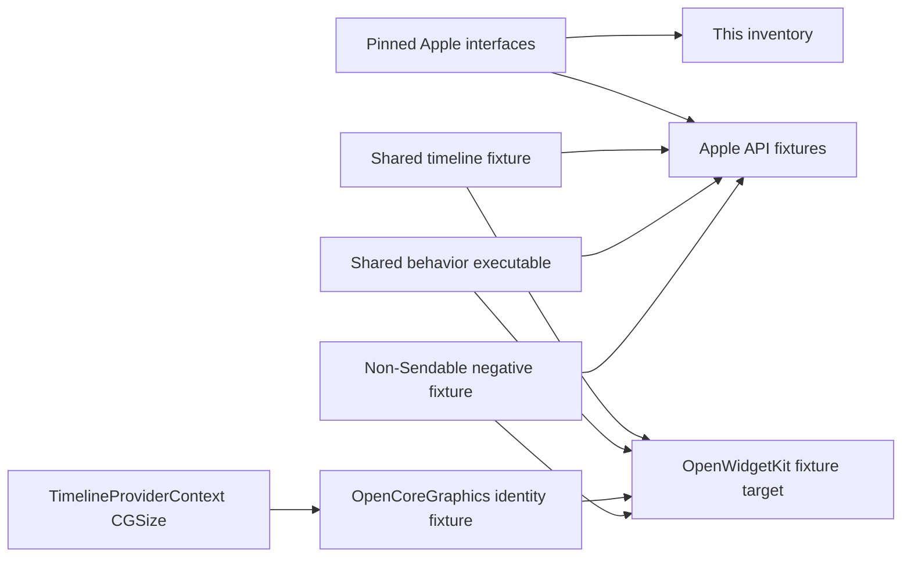

# OpenWidgetKit API Compatibility Baseline

## Purpose

This document is the source-of-truth for the initial Widget API inventory and
the M2/M3 source-compatibility surface.
It separates Apple SDK facts from OpenWidgetKit implementation status. An API
listed here is not implemented merely because its Apple declaration and compile
fixture have been recorded.

## Pinned Apple baseline

| Component | Pinned identity |
|---|---|
| Xcode | 27.0, build `27A5237l` |
| macOS SDK | 27.0, build `26A5406c` |
| iOS SDK | 27.0, build `24A5408c` |
| watchOS SDK | 27.0, build `24R5346a` |
| visionOS SDK | 27.0, build `24M5347a` |
| tvOS SDK | 27.0, build `24J5346a`; no WidgetKit framework is present |
| Swift compiler | Swift 6.4 development snapshot, compiler commit `424cae54c1a10da` |
| macOS SwiftUI / SwiftUICore / WidgetKit interfaces | SHA-256 `4360bfdc6d8d82d387805414cfe0159a9d78d261aee97a214d0c77f5ef01ff90` / `2f5f6d708ec1d7d2a5fc63cf27eb57f3cbce7beb29f4ca1436e08e893d40bfb3` / `57f637423a9fc5cb1d796728142e87aeeebc803dbaa14831adb11cdf2736314c` |
| iOS SwiftUI / SwiftUICore / WidgetKit interfaces | SHA-256 `b74bc6cfd5a4e1d4b68de8a3d3c6ec6ec36e13b92d4d7db5b6436ef4925c9f51` / `5664b8453cfdb2534c9444d153d070a2a94f0fcc9b9d16f88e42eee60e94c0cc` / `6937fef5e51dda7842de9085b3206713bb9475c425ee88f6c2b6f246d52ee1b4` |
| watchOS SwiftUI / SwiftUICore / WidgetKit interfaces | SHA-256 `b56d2190f2716aad4e46685f366c023dab44ae672ede558ca4ac16305cb153d6` / `4b1c9a11810fc3ae7d414966014d71115015fc48e65ad45783f6415d8c6a0cb5` / `b38b91345630636e5eaf4c9effcb33d66c7d155ae31439d4146cac1a67619a28` |
| visionOS SwiftUI / SwiftUICore / WidgetKit interfaces | SHA-256 `fb46f2f2c9cff14cbe35b7eec19e55811cffcdc558e0b64771ecea3b40dae1b2` / `27e01eea3b2673579ee4befd4f7c99d3598292ec71112d7de94e453b97df85e9` / `de1e37b5fda694b5998c91218776be7e20e4b6afc53688b2b20fd86c31e0bdaf` |

The interface hashes are verification inputs. The SDK files remain the
authority; this repository does not copy the complete Apple interfaces.

## Initial API inventory

The initial baseline is the iOS 14/macOS 11 callback-based static-widget
surface. The declarations below normalize SDK qualification such as
`Swift::String` to ordinary Swift source syntax.

| Family | Module | Exact initial contract | Availability and isolation | Implementation milestone |
|---|---|---|---|---|
| `Widget` | SwiftUI | `associatedtype Body: WidgetConfiguration`; `init()`; `var body: Body { get }` | iOS 14, macOS 11, watchOS 9, visionOS 1; tvOS unavailable; protocol, initializer, and body are `@MainActor @preconcurrency` | M2/M3 |
| `WidgetConfiguration` | SwiftUI | recursive `associatedtype Body: WidgetConfiguration`; `var body: Body { get }`; Apple has a default low-level graph requirement | iOS 14, macOS 11, watchOS 9, visionOS 1; tvOS unavailable; `@MainActor @preconcurrency` | M2/M3 |
| `WidgetBundle` | SwiftUI | `associatedtype Body: Widget`; `init()`; `@WidgetBundleBuilder var body: Body { get }` | iOS 14, macOS 11, watchOS 9, visionOS 1; tvOS unavailable; `@MainActor @preconcurrency` | M3 |
| `StaticConfiguration<Content>` | WidgetKit | `Content: View`; `body: some WidgetConfiguration`; generic initializer constrained by `Provider: TimelineProvider`, with `@ViewBuilder @escaping (Provider.Entry) -> Content` | iOS 14, macOS 11, watchOS 9, visionOS 26; tvOS unavailable; type/body/initializer are `@MainActor @preconcurrency`; current SDK also declares `Sendable` | M2/M3 |
| `TimelineEntry` | WidgetKit | `date: Date`; `relevance: TimelineEntryRelevance?`; default relevance is `nil`. Relevance is `Codable`/`Hashable`, with mutable `Float` score, mutable `TimeInterval` duration, and an initializer whose duration defaults to zero | iOS 14, macOS 11, watchOS 9, visionOS 26; tvOS unavailable | Implemented initial slice |
| `TimelineProvider` | WidgetKit | `associatedtype Entry: TimelineEntry`; `Context` alias; placeholder, snapshot, and timeline operations | same WidgetKit initial availability; callback operations are `@preconcurrency` and completions are `@escaping @Sendable` | Declaration implemented; completion ownership is M3 |
| `TimelineProviderContext` | WidgetKit | environment variants, family, preview flag, and `CGSize` display size; both writable-key-path environment subscripts return optional arrays; neither context type has a public initializer | same WidgetKit initial availability | Implemented initial value slice |
| `Timeline<EntryType>` | WidgetKit | `EntryType: TimelineEntry`; immutable entries and policy; public initializer | same WidgetKit initial availability | Implemented initial slice |
| `TimelineReloadPolicy` | WidgetKit | `Equatable` only; `.atEnd`, `.never`, and `.after(Date)`; no public initializer | same WidgetKit initial availability; not `Sendable` | Implemented initial slice |
| `WidgetFamily` | WidgetKit | raw `Int`; raw-representable, debug/string convertible, `Sendable`, and `Hashable`; initial cases are small, medium, and large | enum has same WidgetKit initial availability; the three initial cases are unavailable on watchOS and tvOS | Implemented initial slice |
| `WidgetCenter` | WidgetKit | singleton with no public initializer; callback current-configurations query; reload by kind; reload all; nested `UserInfoKey` exposes kind, family, and activity-ID keys | same WidgetKit initial availability; configuration callback is `@preconcurrency` with an `@escaping @Sendable` completion | M3 |

`Widget.main()` and `WidgetBundle.main()` are supplied by WidgetKit extensions
and are `@MainActor @preconcurrency`. Swift owns the process entry point in the
planned Windows provider architecture.

The replacement entry-point extensions are intentionally `async`, while the
Apple SDK declarations are synchronous. This is a documented Windows
portability difference: the MainActor must suspend while the C++/WinRT local
server waits, otherwise timeline content evaluation would deadlock behind a
blocking synchronous `main()`. Consumer syntax remains `@main struct ...:
Widget`; code that explicitly takes or invokes the static `main` function does
not have an exact signature match.

### M2 SwiftUI subset inventory

The following is the deliberately bounded semantic surface. Each declaration
keeps the current SDK's source-facing generic constraints, labels, builder,
availability, isolation, and relevant conformance behavior. APIs not listed
remain undeclared.

| Family | Supported source contract |
|---|---|
| view protocols/builders | `View`, `ViewBuilder`, `ContentBuilder` alias, `DynamicProperty`, `EnvironmentKey`, `EnvironmentValues`, and `@Environment`; `ViewBuilder: Sendable` remains explicitly unavailable |
| structural content | `EmptyView`/`EmptyContent`, `TupleView`, `_ConditionalContent`, optional content, `AnyView`, and unconstrained `Group<Content>` with conditional `View` conformance |
| layout | `VStack`, `HStack`, `Spacer`, `Divider`, `HorizontalAlignment`, `VerticalAlignment`, `Alignment`, `Edge`, and `EdgeInsets` |
| values | `LocalizedStringKey`, `Text`, limited named/system `Image`, `Color`, `ColorScheme`, `Font`, and `ShapeStyle: Sendable` |
| collection | both initial `ForEach` initializers with stable `Hashable` identity |
| modifiers | initial padding and frame overloads, font, foreground color, line limit, three background overloads, environment, and color scheme |

The M2 semantic document preserves ignored safe-area edges, localized versus
verbatim text, image labels/decorative state, resource identity, view identity,
environment snapshots, and modifier parameters. Unsupported custom primitive
views, environment keys, styles, invalid layout ranges, invalid line limits,
nonfinite values, and invalid resources fail with typed semantic errors.

### Exact timeline declarations

```swift
public protocol TimelineEntry {
    var date: Date { get }
    var relevance: TimelineEntryRelevance? { get }
}

public protocol TimelineProvider {
    associatedtype Entry: TimelineEntry
    typealias Context = TimelineProviderContext

    func placeholder(in context: Context) -> Entry
    @preconcurrency
    func getSnapshot(
        in context: Context,
        completion: @escaping @Sendable (Entry) -> Void
    )
    @preconcurrency
    func getTimeline(
        in context: Context,
        completion: @escaping @Sendable (Timeline<Entry>) -> Void
    )
}

public struct Timeline<EntryType> where EntryType: TimelineEntry {
    public let entries: [EntryType]
    public let policy: TimelineReloadPolicy
    public init(entries: [EntryType], policy: TimelineReloadPolicy)
}
```

### Intentional portable differences

Apple's `WidgetConfiguration` has a public low-level graph requirement whose
signature names SwiftUI implementation types. OpenWidgetKit does not reproduce
those private graph types. Its protocol preserves the source-facing `Body`
contract and uses a package-internal host-neutral lowering requirement with a
recursive default implementation.

The same rule applies to Apple low-level graph requirements on `View`,
`DynamicProperty`, and `ShapeStyle`. OpenWidgetKit preserves the source-facing
protocol relationships, including `DynamicProperty.update()` and
`ShapeStyle: Sendable`, but owns semantic lowering through package-internal
contracts instead of declaring placeholder graph types.

The replacement package's macOS deployment floor is macOS 15 because its
host-neutral runtime uses `Synchronization.Mutex`. Individual public
declarations retain Apple's availability annotations. Apple applications do
not link the replacement on macOS, and native replacement builds are conformance
tests rather than a back-deployed product promise.

The pinned Swift 6.4 snapshot can emit `#SendableMetatypes` while the
`TimelineProvider` bridge captures `Provider.Entry.Type` in the callback
handoff. Adding `Provider.Entry: SendableMetatype` would change Apple's public
generic contract, so OpenWidgetKit keeps the exact unconstrained associated
type and confines the one-shot value transfer to a mutex-protected owner. This
diagnostic is tracked by [Swift issue 82116](https://github.com/swiftlang/swift/issues/82116);
it is not suppressed by weakening the public API.

`TimelineReloadPolicy` must remain non-`Sendable`, matching Apple. Swift 6 rejects
stored global values whose public type is not `Sendable`, even when the values
are immutable. OpenWidgetKit therefore marks only `.atEnd` and `.never` as
`nonisolated(unsafe)`. Their stored representation is immutable and composed of
`Sendable` values. This annotation does not add a public `Sendable` conformance;
the negative fixture proves that both Apple and OpenWidgetKit reject such a
constraint.

The shared-state review matrix is identical on every target:

| Logical value | Native | normal WASM | Windows | Mutation | Lifetime/release |
|---|---|---|---|---|---|
| `.atEnd` | immutable `TimelineReloadPolicy` static storage | same storage and annotation | same storage and annotation | none | process lifetime; value storage has no external resource |
| `.never` | immutable `TimelineReloadPolicy` static storage | same storage and annotation | same storage and annotation | none | process lifetime; value storage has no external resource |

There is no Embedded branch, alternate raw state, callback, I/O, or external
resource inside either value. `.after(Date)` creates a new value and does not
touch static storage.

`WidgetCenter.getCurrentConfigurations` introduces `WidgetInfo`. The initial
Windows implementation will preserve `kind` and `family`. The Apple-only
`INIntent?` configuration property is outside the static configuration baseline
until an Intents compatibility module is designed; it must not be replaced with
an unrelated placeholder value.

## Explicitly out of scope for the initial baseline

- App Intent configuration and `AppIntentTimelineProvider`;
- provider `relevance()` and `WidgetRelevance`;
- Live Activities and ActivityKit;
- Control Widgets;
- accessory and post-iOS-14 widget families;
- interactive App Intents and configuration recommendations;
- preview-only and developer-tools APIs;
- Apple low-level graph implementation types.

An out-of-scope API remains undeclared until its own inventory and semantic
contract are complete.

## Compatibility fixtures



| Fixture | Contract checked |
|---|---|
| `Fixtures/AppleAPI/CanonicalStaticWidget.swift` | `Widget`, `WidgetConfiguration`, `StaticConfiguration`, `ViewBuilder`, `Widget.main()` |
| `Fixtures/AppleAPI/CanonicalWidgetBundle.swift` | `WidgetBundle`, `WidgetBundleBuilder`, `WidgetBundle.main()` |
| `Fixtures/AppleAPI/WidgetCenterSurface.swift` | initial `WidgetCenter` query and reload call shapes |
| `Fixtures/AppleAPI/OpenWidgetKitFoundationSurface.swift` | `CGSize` and both environment-variant key-path subscripts |
| `Fixtures/SharedAPI/InitialTimelineSurface.swift` | one source file against Apple and replacement timeline APIs, including Foundation geometry |
| `Fixtures/SharedAPI/M2M3Surface.swift` | the M2 View DSL, static configuration modifiers, WidgetBundle builder, and WidgetCenter call shapes against Apple and replacement modules |
| `Fixtures/BehaviorAPI/M1Behavior.swift` | differential runtime output for initial family, reload-policy, and relevance behavior |
| `Fixtures/NegativeAPI/TimelineReloadPolicySendable.swift` | both implementations reject the non-Apple `Sendable` conformance |
| `Fixtures/NegativeAPI/ViewBuilderSendable.swift` | both implementations preserve the explicitly unavailable `ViewBuilder: Sendable` conformance |
| `Fixtures/WorkspaceAPI` | OpenWidgetKit context geometry passes directly into OpenCoreGraphics APIs without conversion |

Run `scripts/verify-m1-api.sh` on the pinned macOS host. It validates every
recorded interface hash, typechecks Apple fixtures for macOS 11, iOS 14,
watchOS 9, and visionOS 26, confirms WidgetKit is absent from tvOS, builds the
replacement fixture, checks the negative conformance, compares
Apple/replacement runtime output, and builds the isolated workspace identity
fixture.

## Pinned Windows compile baseline

| Component | Pinned identity |
|---|---|
| Swift installer | `swift-6.4.x-DEVELOPMENT-SNAPSHOT-2026-08-14-a-windows10.exe` |
| Official artifact URL | `https://download.swift.org/swift-6.4.x-branch/windows10/swift-6.4.x-DEVELOPMENT-SNAPSHOT-2026-08-14-a/swift-6.4.x-DEVELOPMENT-SNAPSHOT-2026-08-14-a-windows10.exe` |
| Artifact size | 2,100,445,560 bytes |
| Artifact SHA-256 | `17D5EBA8DFDC9E99BF13C0F26169022BE2F816B19E66D883A596D3512CFB0A04` |
| Artifact ETag | `000596E80AF6A46E3F79C3C61829E94B` |
| Swift source tag | `swift-6.4.x-DEVELOPMENT-SNAPSHOT-2026-08-14-a` |
| Peeled source commit | `424cae54c1a10da79456ce66f330e6639439368f` |
| Initial target | `x86_64-unknown-windows-msvc` |

Foundation, FoundationEssentials, FoundationInternationalization, the standard
library, and runtime DLLs must all come from this one installer. The package does
not download a separate swift-foundation product.

`scripts/verify-m1-windows.ps1` is the Windows execution gate. It builds the
shared replacement and OpenCoreGraphics identity fixtures, executes the
replacement behavior fixture, proves the non-Apple `Sendable` conformance is
rejected, and emits the exact installed Foundation artifact hashes. A macOS
cross-compile is not accepted as Windows evidence.
`.github/workflows/m1-windows.yml` provisions the pinned installer on a real
Windows runner, checks its SHA-256, checks out the exact sibling-package commits,
executes the gate, and uploads the JSON evidence. The workflow is dispatch-only.

## Evidence status

As of 2026-08-20, the pinned Apple API fixtures, including the M2/M3 source
surface, typecheck for macOS 11, iOS 14, watchOS 9, and visionOS 26, and the
replacement checks pass on the local arm64 macOS host. All 44 focused M2/M3
Native behavior test declarations pass. The 15 M4/M5 host-neutral Native test
declarations also pass, and the normal WASM API, behavior, and M4 targets build
with the pinned Swift 6.4 snapshot. The Windows evidence below remains the M1
baseline and does not yet cover M2-M5.

The pinned Windows gate passed on the `win25-vs2026` x86_64 runner in
[GitHub Actions run 32320007986](https://github.com/1amageek/OpenWidgetKit/actions/runs/32320007986)
at head `b8a2c3f150ccf6a764bda60e2e432f5bc763b333`. It compiled both replacement
fixtures, executed the differential behavior fixture, observed the required
non-`Sendable` rejection, and recorded the effective Foundation module and
runtime DLL hashes. The normalized evidence and raw artifact digest are stored
in `Verification/M1_WINDOWS_EVIDENCE.json`. These checks complete the M1 API
inventory and compatibility-fixture milestone. They do not establish Windows
Widgets Board behavior, which belongs to M6.
