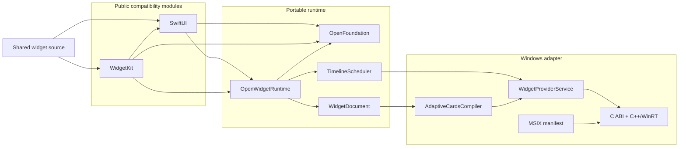
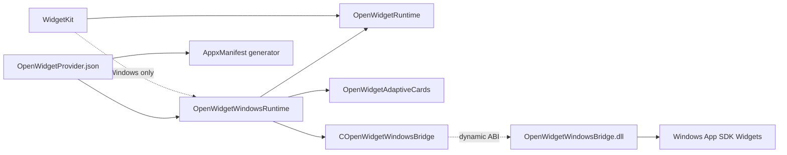
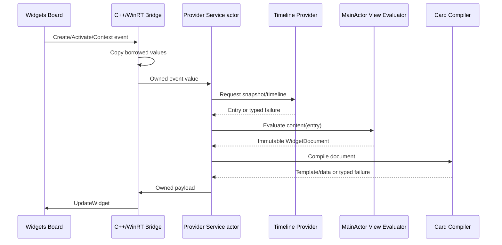

# OpenWidgetKit Design

## Status

この文書はOpenWidgetKitの規範アーキテクチャです。現在はM2 semantic document、host-neutral M3 runtime、
M4 Adaptive Cards compiler、M5 Windows host/package sourceまで実装されています。M4はNative testと通常WASM
target build、M5のhost-neutral Swift surfaceはNative testを通過しました。M5のSwift executable、
C++/WinRT bridge、公式Swift/Foundation runtime closure、unsigned MSIXはnative x64/ARM64 gateを通過しました。
COM activationとWidgets Board runtime検証は未実行です。確認済み事実、
目標設計、必要な変更、未解決事項を
区別して記載します。

timeline validation、provider callback owner、registry、schedulerは`OpenWidgetRuntime`がhost非依存値として
所有します。`WidgetKit`は公開`Timeline`とconfigurationを内部値へloweringし、runtimeが公開WidgetKit型へ
依存する逆流はありません。Windows host adapterはgeneration fenceを実装してこのruntimeを消費します。

## Confirmed current facts

### Apple framework ownership

- `Widget`、`WidgetConfiguration`、`WidgetBundle`はSwiftUI moduleに所属する。
- `StaticConfiguration`、`TimelineProvider`、`Timeline`、`WidgetCenter`はWidgetKit moduleに所属する。
- Widgetはconfiguration、timeline provider、SwiftUI Viewの三要素から構成される。

この責務は2026-08-19にApple documentationを`remark`で読み、MacOSX 27.0 SDKの
`.swiftinterface`で確認しました。

### Windows widget host

- 現行Windows Widget Providerはpackaged Win32 appまたはPWAとして実装される。
- Win32 Providerはout-of-process COM local serverとして`IWidgetProvider`を実装する。
- UIはProviderが返すAdaptive Cards template/data JSONをWidgets Boardが描画する。
- callback引数のWinRT objectはcallback scope外での有効性が保証されない。
- Win32 Providerの登録にはpackage manifestとCOM class registrationが必要である。

### CoreFoundation workspace

- OpenCoreGraphicsの現行非WASM `CGContext`はsoftware rendererを選択するが、Windowsでの
  build/runtimeはこのpackageのrenderer証拠としてまだ確認されていない。
- OpenCoreAnimationのrenderer factoryはWASMをWebGPU、それ以外をMetalとしており、
  Windows backendは存在しない。
- CoreFoundation workspace内にOpenSwiftUI/OpenWidgetKitの既存実装はなかった。

### Swift Foundation distribution

- Swift 6以降のWindows Foundationはtoolchainに組み込まれ、`FoundationEssentials`と
  `FoundationInternationalization`の共通Swift実装を使用する。
- 非Darwinの`Foundation` moduleはswift-corelibs-foundationが提供する互換umbrellaであり、
  Essentials、Internationalization、CoreFoundation、geometry、`Bundle`などを統合する。
- `FoundationEssentials`だけでは`CGFloat`、`CGPoint`、`CGSize`、`CGRect`および完全な`Bundle`を
  提供しない。
- OpenFoundationのsource boundaryは非Embeddedでtoolchain Foundationをre-exportし、Embeddedで
  portable subsetとCFCG値型を宣言する。Native、通常WASM、Embedded WASM、Windowsの対象gateで
  geometry identityとFoundation boundaryが確認済みである。
- OpenCoreGraphicsはOpenFoundationへ直接依存して同じCFCG値型をre-exportする。このためWindows、
  WASM、EmbeddedのOpenCoreGraphicsとOpenWidgetKitは変換なしで同じ値identityを共有する。

## Required invariants

1. Widget sourceのimportと宣言はApple/Windowsで同一にする。
2. package identityと公開module identityを分け、moduleは`SwiftUI`/`WidgetKit`とする。
3. Apple buildではsystem frameworkを使い、package replacementをlinkしない。
4. Windows/Webはplatformとして選び、Package Traitやmacroで偽装しない。
5. View DSL、host-neutral runtime、Windows adapterを分離する。
6. unsupported behaviorを無視または偽の成功値へ変換しない。
7. WinRT/COM lifetimeをSwift object lifetimeへ漏らさない。
8. UIKit/AppKit/responder chainをWidget runtimeの依存にしない。
9. Foundationの選択はOpenFoundationに集約し、consumer packageで直接分岐しない。
10. WindowsのFoundation値型を再定義せず、OpenCoreGraphicsと同じ型identityを共有する。
11. EmbeddedではFoundation familyをimport/linkせず、size効果を最終binaryで検証する。
12. shipping full Swift buildではtoolchain組み込みFoundationを使用し、swift-foundation package版を混在させない。

## Ideal architecture



実装された依存方向は次です。Windows backendは`WidgetKit`からWindows条件でのみ選択され、
compilerやhostから公開SwiftUI/WidgetKitへ逆流しません。



Schema 5の`OpenWidgetProvider.json`がCLSID、kind、family、asset、toolchain/runtime方針の正本です。
M5のSwift executableがpackaged appのownerであり、C++/WinRT bridge DLLはself-contained appではありません。
生成manifestは`Microsoft.WindowsAppRuntime.2` version 2.3.1.0以上を明示的に要求し、Widgets DLLを含む
framework packageはWindows package graphが解決します。
Bundled resourceはpackage-relative `path`だけを保存し、`ms-appx:///` URIはresolverがそのpathから
導出します。WindowsがURIをpercent-decodeした後に別のpathへ正規化しないよう、resource pathは
ASCIIのunreserved文字と`/`だけに制限します。
Widget bodyをbuild時に実行してmanifest metadataを推測しません。runtime開始時にはlowering済みregistryと
configurationを集合比較し、driftをtyped failureにします。

The Windows replacement uses an async `Widget.main()`/`WidgetBundle.main()`
entry point. Apple's extension is synchronous, but a synchronous replacement
would occupy MainActor while the COM server blocks and prevent later timeline
View evaluation. This is the narrow documented API difference; the consumer's
`@main` widget declaration is unchanged.

## Why one package with two public products

初期設計ではOpenSwiftUIとOpenWidgetKitを別packageにする案も考えられます。しかし、
Appleのmodule境界では`Widget`がSwiftUI、具象configurationがWidgetKitにあり、両方が
同一の隠れたconfiguration/runtime contractを共有します。

| Distribution | Benefit | Cost |
|---|---|---|
| one package, two products | `package` access、atomic version、循環依存なし | release単位が共通 |
| two packages plus runtime package | release責務を分離できる | 三packageのversion lock、公開SPIが必要 |
| two packages with duplicated runtime | 独立して見える | contract drift、ownership重複、採用しない |

最初のproduction implementationはone package/two productsを採用します。将来、一般用途の
完全なOpenSwiftUIが成立した場合にだけ、安定した内部runtime protocolをversioned productへ
切り出すことを再検討します。

## Why this is not a UIKit/AppKit port

Widgetはapplication windowの中で継続的にevent dispatchを受けるView hierarchyではありません。
Windows側もWidgets Boardが描画し、Providerにはcreate/update/action/context eventが届きます。

```text
Application UI
    event loop -> responder chain -> platform controls

Widget
    timeline snapshot -> host document -> discrete host action
```

したがって`UIResponder`/`NSResponder`の移植はWidgetKit互換の前提ではありません。これを追加すると
scopeとlifetime modelが不必要に一般application UIへ拡大します。

## Why WidgetDocument exists

SwiftUI ViewからAdaptive Cards JSONへ直接変換すると、公開DSLがWindows host schema、version、
fallback behaviorへ結合します。host-neutral documentを挟むことで次を分離できます。

- SwiftUI source compatibility;
- Widget semantic/layout model;
- Windows Adaptive Cards output;
- 将来のWASI/browser output;
- semantic fixtureとrenderer fixture。

IRは最低公倍数だけに縮退させません。SwiftUI側の意味を保持し、各rendererがcapabilityを判定します。
表現できない意味はcompiler errorとして返します。

## Foundation and geometry ownership

公開互換APIではOpenFoundationをimport境界、toolchain Foundationをfull Swiftの型identityと配布の
正本にします。

```text
OpenWidgetKit SwiftUI / WidgetKit / Runtime
    -> OpenFoundation
        -> full Windows Swift
            -> pinned toolchain Foundation umbrella
                -> FoundationEssentials
                -> FoundationInternationalization
                -> CoreFoundation compatibility
                -> CGFloat / CGPoint / CGSize / CGRect
                -> Bundle and resource lookup

        -> Embedded Swift
            -> portable values only
            -> no Foundation family link

OpenCoreGraphics
    -> OpenFoundation
        -> canonical CFCG value identity
    -> geometry operations / drawing / rendering
```

OpenWidgetKit内にgeometry-only moduleを新設せず、`CGFloat = Double`のような独自typealiasも
追加しません。Foundationの`CGFloat`はtarget architectureに応じた`NativeType`と値semanticsを
持つため、単なるstorage型へ縮退させるとsource compatibilityと型identityが失われます。

最初のproduction targetであるWindowsでは、geometryはOpenFoundationが再公開するtoolchain
Foundationから得られます。OpenFoundation自体はEmbeddedでportable CFCG値を提供しますが、
OpenWidgetKitは現在`Codable`を含むApple互換surfaceを持つためEmbedded targetをadvertiseしません。
値型だけを使うWidget runtimeがrenderer/WebGPUを引き込む必要はありません。rasterizationを選ぶ
backendだけがOpenCoreGraphicsへ依存します。

View DSLとtimeline contextはFoundation geometryを受け取り、host-neutral `WidgetDocument`は
意味的なlayout constraintへloweringします。Windows C ABIへFoundation structを渡さず、最終的な
JSON/resource bufferだけをowner、byte count、release callback付きで渡します。

OpenWidgetKitは`FoundationEssentials`を直接採用しません。full Windowsでは同じProvider processが
公開SwiftUI/WidgetKitのためにFoundation umbrellaを必要とし、EmbeddedではOpenFoundationが
Foundation familyを完全に外すためです。

Windows配布では、host runtime directoryやSDK全体から同名DLLを探索しません。x64とARM64を
それぞれ同じarchitectureのnative Windows runnerとSwift installerでbuildし、SDK同梱の
redistributable merge moduleをruntimeの正本にします。M5は固定installerに含まれるSwift 6.4の
`rtl.shared.amd64.msm`または`rtl.shared.arm64.msm`のembedded cabinetを、producerと同じ
WiX 4.0.5で直接展開し、application-privateなruntimeとしてMSIXへ含めます。ここで`shared`は
dynamic Swift linkageを表し、machine-wideな
配置を意味しません。全PEのmachine、Foundation必須DLL、最終
dependency closure、merge moduleとWiX SDKのhashをarchitectureごとに検証します。

## Rendering strategy

### Milestone 1: Adaptive Cards native mapping

初期backendはMicrosoftが正式に定義するAdaptive Cards template/dataです。text、image、stack、
basic style、family、actionの意味をnative host elementへmappingします。

M4 sourceで確定したsupport matrixは次です。hostが同じ意味を表現できないmodifierを削除して
成功扱いせず、`AdaptiveCardCompilationError`にします。

| Semantic input | M4 output/contract |
|---|---|
| `Text` | `TextBlock`; valueはdata binding、font role、semantic palette、line limitを保持 |
| named `Image` | configured `ms-appx:///` URI; system imageとApple bundle identityは明示的unsupported |
| `VStack` | `Container`; order、horizontal alignment、host spacing tokenを保持 |
| `HStack` | `ColumnSet`; order、vertical alignment、horizontal `Spacer`を保持 |
| `Group` | identityを検証してsemantic flattening |
| `Spacer` / `Divider` | stretch element / separator element |
| semantic color background | `Container.style`; partial safe-area bleedはunsupported |
| `padding` | Adaptive Cards 1.6にinner-padding同値契約がないためunsupported |
| `frame` | SwiftUIのmin/ideal/max constraint全体を保持できないためunsupported |
| arbitrary RGB/HSB | host paletteで同値にならないためunsupported |

light/darkは同じentryを二つの`EnvironmentValues`で評価し、それぞれ独立したdata namespaceへ
compileします。familyとthemeは`$host.widgetSize`/`$host.hostTheme`条件で選択します。template cacheは
host capability、family、theme、値を除いたsemantic structureからexact keyを先に生成します。cache hitは
text、localized value、image URI、resource ownershipだけを再評価し、template treeとJSONを生成しません。
entryはcanonical template、そのSHA-256 external identity、template生成時に確定したnode path単位の
binding planを保持します。data materializationはcache miss/hitの両方でこのplanだけを使うため、templateと
dataが別々にbinding順序を推測する経路はありません。digestだけをcache keyにしないため、hash collisionで
別templateを共有しません。

### Future: rasterized resource

Canvas、Path、複雑なgradientなど、静的画像として意味を保てるものはOpenCoreGraphicsによる
rasterizationを検討できます。ただし次を確認するまで依存を追加しません。

- OpenCoreGraphicsのWindows compile/link/runtime;
- Windows hostが動的resourceを安全に取得できる形式;
- scale/theme/accessibilityごとのcache identity;
- image化によるsemantic/accessibility lossの許容範囲。

### Excluded: OpenCoreAnimation

Widgetのtimeline snapshotにcontinuous frame animationは不要です。現行OpenCoreAnimationには
Windows backendもないため、初期依存関係から除外します。

### Future: HTML web widgets

WindowsのWeb Widgetはremote `webUrl`を使い、Adaptive Card fallbackも必要です。local Swift
ViewをそのままHTMLとして送り込める一般backendではありません。deployment、security、offline、
authenticationの契約が異なるため、Adaptive Cards backendとは別milestoneにします。

## Platform composition

```text
Shared Swift source
    -> protocol-defined runtime contracts
        -> Windows composition root
            -> AdaptiveCardsCompiler
            -> WidgetProviderService
            -> WindowsWidgetBridge

        -> future WASI composition root
            -> Web document compiler
            -> JavaScript host adapter
```

platform conditionalはcomposition rootとSwiftPM dependency conditionに限定します。View、timeline、
configurationの公開実装内へ`#if os(Windows)`を散在させません。

## State and data flow



## Shared-state and ownership review matrix

M2/M3のshared sourceにはEmbedded分岐、raw-state fallback、no-op lockはありません。Windows列は同じ
source contractを示します。M2/M3のWindows compile gateはx64/ARM64で通過し、runtime behaviorは未実行です。

| Logical state | Native storage/isolation | normal WASM | Windows contract | Read/mutation entry | Shutdown/release |
|---|---|---|---|---|---|
| runtime instances, activity, and lifetime generations | `WidgetRuntimeService` actor with generation tombstones | same actor | same actor; x64/ARM64 compiled, runtime pending | actor methods only | deactivation cancels scheduled work; deletion retains the last generation; shutdown removes instances |
| provider request terminal state | `Mutex<State>` | same `Mutex<State>` | same `Mutex<State>`; x64/ARM64 compiled, runtime pending | `claimProviderCallback` and exactly-once `complete` | timeout task cancelled and continuation resumed once |
| provider callback value handoff | `Mutex<Payload>` one-shot owner | same owner | same owner; x64/ARM64 compiled, runtime pending | callback installs, MainActor consumes once | payload cleared on take; late/duplicate callback rejected |
| runtime composition | `Mutex<State>` | same `Mutex<State>` | same `Mutex<State>`; x64/ARM64 compiled, runtime pending | install/current/uninstall composition functions | uninstall clears both references |
| view identity map | `WidgetIdentityStore` on `MainActor` | same isolation | same isolation; x64/ARM64 compiled, runtime pending | one transaction spans every entry and environment variant in a requested timeline | unused identities are pruned only after complete success; any failed nested evaluation rolls back; remaining state is released with the widget instance |
| semantic document/resources | immutable `Sendable` values | same values | same values; x64/ARM64 compiled, runtime pending | constructed on `MainActor`, read by runtime/host | value lifetime; no external handle |
| host generation fence | test host uses actor state | protocol contract only | `WindowsAdaptiveCardHost` actor plus C++ operation fence; x64/ARM64 built, runtime pending | invalidate/apply/remove | removal rejects updates through its generation; a later lifetime requires a strictly newer generation and a complete template |

M4/M5で追加したstateはWindows adapter graphへ限定されます。Embedded SwiftはOpenWidgetKitの対応targetでは
なく、Windows stateをraw storageへ置換する条件分岐もありません。

| M4/M5 logical state | Native test storage/isolation | normal WASM | Embedded WASM | Windows storage/isolation | Read/mutation/release |
|---|---|---|---|---|---|
| template cache | `Mutex<CacheState>` | target not selected | unsupported target | same `Mutex<CacheState>` | compiler methods; bounded eviction; compiler lifetime |
| callback event queue | `Mutex<State>` in focused tests | target not selected | unsupported target | same `Mutex<State>` | enqueue/drain; external actor callback outside lock |
| provider controller | actor | target not selected | unsupported target | same actor | ordered active/inactive lifecycle; retryable service shutdown then exactly-once accepted bridge completion |
| Swift host fence | actor dictionary | target not selected | unsupported target | same actor dictionary | invalidate/apply/remove; bridge I/O actor-ordered |
| C ABI handle | immutable opaque owner with documented unchecked boundary | target stub rejects use | unsupported target | same owner over C++ state | exactly-once `owk_bridge_close` in deinit |
| C++ generations/operations | not linked | not linked | not linked | mutex-protected fence plus one operation thread | the class factory follows the Widget Provider `no_module_lock` contract while created provider objects use the custom process lock; recovery is queued before the COM class object is resumed; validation runs before queue and before/after `UpdateWidget`; deletion never blocks a reentrant callback; the payload-free shutdown callback allocates no owner; destructor joins |

M5 preserves two commit/lifetime invariants. The Swift callback owner remains
retained until the dynamically loaded provider is destroyed; shutdown completion
cannot be signaled until the C++/WinRT module count reaches zero, so no retained
COM provider can call a released Swift context. Separately, the Swift host actor
records a structure identity only after `UpdateWidget` succeeds. A later update
may omit `WidgetUpdateRequestOptions.Template` only when that same instance has
already accepted the same structure; recovery and structural changes always send
the full template.

Instance generations are monotonic across delete/recreate cycles within the
process. A removal is a tombstone through its generation, not a permanent ban on
the host identifier. Recreating an identifier requires a strictly newer
generation and clears the previously accepted template identity because the new
Widgets Board instance does not inherit the old instance's template state.
Swift invalidation fences commit only after the C bridge accepts the same
transition. Removal is intentionally fail-closed: once the host reports deletion,
a later bridge cleanup failure cannot reopen that lifetime. Existing widgets are
recovered and queued before `CoResumeClassObjects` makes the provider callable,
preventing activation/context callbacks from overtaking startup recovery.
The dynamic-loader boundary maps ABI status codes back to typed Swift errors;
stale-generation errors retain their instance ID and generation instead of being
collapsed into a generic host rejection.

Activity and initial-content ownership are separate contracts. `CreateWidget`
requests one initial timeline even when its context is inactive, then suppresses
future scheduled work. An inactive startup recovery keeps the template/data
already owned by the Widgets Board and defers provider work until activation or
an explicit reload only when nonempty host `CustomState` proves that a prior
update was accepted. Recovery with empty state follows the initial-content path.

Stable `ForEach` identities are retained only for the complete timeline currently
owned by an instance. The identity transaction spans every timeline entry and
environment variant so light/dark variants cannot prune one another. A failed
lowering restores the prior map and the next identifier; only a fully successful
evaluation prunes unused values.

`TimelineProvider.Entry`はApple API上`Sendable`を要求しませんが、completionは`@Sendable`です。この互換境界だけは
callbackが引き渡した`Timeline<Entry>`を`Any` payloadとしてMutex ownerへ移し、MainActorで一度だけ取り出します。
`Payload`の`@unchecked Sendable`はこの一箇所に限定し、providerはcompletion後に同じentry aliasを変更しないことを
ownership contractとします。`Provider`と`Content`自体は`StaticConfigurationStorage`のMainActor isolationから
外へ出しません。

## Error philosophy

Apple hostがunsupported Viewを無視する場合があっても、OpenWidgetKitはそれを一般的なfallback
contractとして採用しません。Windows hostとの差異を無言で拡大するためです。

次を区別します。

- source/API unavailable;
- configuration invalid;
- provider failed or timed out;
- semantic document invalid;
- renderer cannot represent a supported semantic;
- resource unavailable;
- host rejected update;
- manifest/runtime mismatch。

エラー後に直前の正常payloadを表示し続けることは可能ですが、それは新しい更新を成功扱いする
こととは区別し、diagnosticへ残します。

## Library-specific principles

CoreFoundation workspaceの既存設計との関係は次の通りです。

| Principle | Classification | OpenWidgetKit decision |
|---|---|---|
| public API compatibility | 一致 | 固定SDK interfaceとfixtureで管理 |
| platform adapter behind protocol | 一致 | host/compiler/bridgeを内部protocolで分離 |
| pure Swift public surface | 一致 | COM/C++はbridge target内に隔離 |
| `#if` at composition boundary | 一致 | public API bodyへ分散させない |
| renderer strong ownership | 両立可能 | Provider serviceがhost adapterを所有 |
| WASM production first | 衝突 | このpackageの最初のproduction targetはWindows |
| no Objective-C runtime | 両立可能 | Swift surfaceは非ObjC、Windows COMはC++ boundary |
| full framework parity | 両立可能 | milestone別にSource/Semantic/Visualを証明 |

## Decisions

### ADR-001: Direct module names

`SwiftUI`と`WidgetKit`を実module名として提供し、module aliasを使用しません。これにより利用sourceを
変えず、C/C++ bridgeを含むmodule alias制約も回避します。

### ADR-002: Platform conditions instead of traits

Windows/Webは環境のidentityでありoptional featureではないため、SwiftPM platform conditionを
使用します。Traitは将来の加算的capabilityだけに使用します。

### ADR-003: No macro-based backend selection

Macroはdependency graph、COM lifetime、host capabilityを選択できないため採用しません。

### ADR-004: Swift owns `main`

source互換の`@main Widget`を成立させるため、C++ providerはlibraryとしてSwift entry pointから
起動します。

### ADR-005: Adaptive Cards first

Windowsの正式なlocal Provider contractに沿い、remote serviceを必須にしないためです。

### ADR-006: OpenFoundation owns Foundation selection

OpenWidgetKitはOpenFoundationへ依存し、Foundation実装をconsumer targetで選択しません。Windowsでは
OpenFoundationがtoolchain組み込み`Foundation`を再公開し、Foundationの`Date`とCFCG値型を
公開互換APIの正本にします。OpenFoundationのEmbedded modeはFoundation familyをlinkせずportable
subsetを提供しますが、OpenWidgetKitの対象はfull Swiftです。
CFCG値identityはOpenFoundation、graphics operationとrenderingはOpenCoreGraphicsが所有します。
`FoundationEssentials`は公開moduleへ直接使用せず、swift-foundationをpackage dependencyとして
追加しません。

## Required changes from current workspace

| Area | Required work |
|---|---|
| package | 公開`SwiftUI`/`WidgetKit` productと内部runtime target |
| foundation | OpenFoundation再公開、toolchain Foundation type identity、Embedded非link、geometry/source fixture、runtime配布検証 |
| SwiftUI | Widget向けView DSLとWidget protocol surface |
| WidgetKit | Static configuration、timeline、reload surface |
| runtime | registry、type erasure、scheduler、document、errors、shutdown |
| compiler | Adaptive Cards template/data deterministic compiler |
| Windows | C ABI、C++/WinRT Provider、COM class factory、host update |
| packaging | MSIX/AppxManifest、assets、CLSID/kind validation |
| verification | Apple compile fixture、Windows build/link、real Board E2E |

## Unresolved decisions

次は実装開始前または該当milestone前に決定します。

1. manifestが現在要求するWindows 11 `10.0.22000.0`を実機で最小対応versionとして受け入れられるか;
2. image resourceのhost取得方式とcache lifetime;
3. localization bundleとWindows package resourceの対応;
4. App Intents互換を別moduleにするか;
5. package名/module名に関する商標・配布上の確認;
6. 既存OpenSwiftUI projectからAPI fixtureまたは実装を取り込む範囲とlicense review;
7. Embedded Widgetで使用するCFCG値surfaceのAPI/ABI互換fixture。

未解決事項が公開API、所有権、host lifetimeを変える場合、その事項を解消するまで該当実装を
開始しません。
