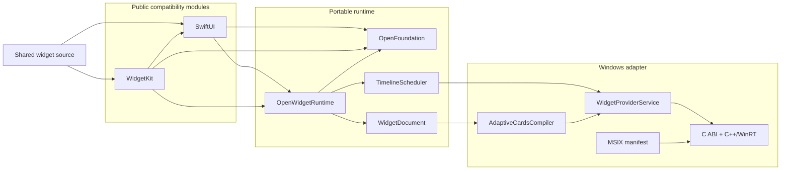
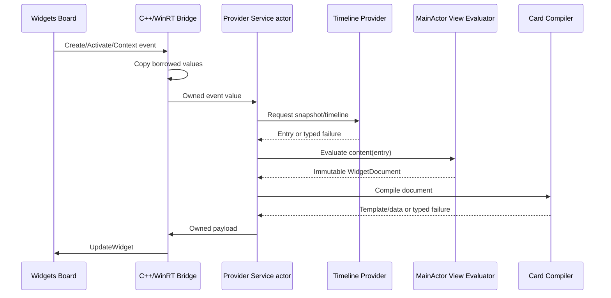

# OpenWidgetKit Design

## Status

この文書はOpenWidgetKitの規範アーキテクチャです。現在は基礎runtime実装段階であり、Package.swift、
OpenFoundation import boundary、初期timeline surface、timeline validationまでsourceがあります。確認済み事実、
目標設計、必要な変更、未解決事項を
区別して記載します。

timeline validationは`OpenWidgetRuntime`がentry date配列とhost非依存reload policyを受け取ります。
`WidgetKit`は公開`Timeline`をこの内部値へloweringするだけであり、runtimeが公開WidgetKit型へ依存する
逆流はありません。scheduler、provider callback owner、Windows host adapterはこのvalidated valueを
消費する後続責務です。

## Confirmed current facts

### Apple framework ownership

- `Widget`、`WidgetConfiguration`、`WidgetBundle`はSwiftUI moduleに所属する。
- `StaticConfiguration`、`TimelineProvider`、`Timeline`、`WidgetCenter`はWidgetKit moduleに所属する。
- Widgetはconfiguration、timeline provider、SwiftUI Viewの三要素から構成される。

この責務は2026-08-19にApple documentationを`remark`で読み、MacOSX 27.0 SDKの
`.swiftinterface`で確認しました。

### Windows widget host

- 現行Windows Widget Providerはpackaged Win32 appまたはPWAとして実装される。
- Win32 Providerはout-of-process COM local serverとして`IWidgetProvider`を実装する。
- UIはProviderが返すAdaptive Cards template/data JSONをWidgets Boardが描画する。
- callback引数のWinRT objectはcallback scope外での有効性が保証されない。
- Win32 Providerの登録にはpackage manifestとCOM class registrationが必要である。

### CoreFoundation workspace

- OpenCoreGraphicsの現行非WASM `CGContext`はsoftware rendererを選択するが、Windowsでの
  build/runtimeはこのpackageの証拠としてまだ確認されていない。
- OpenCoreAnimationのrenderer factoryはWASMをWebGPU、それ以外をMetalとしており、
  Windows backendは存在しない。
- CoreFoundation workspace内にOpenSwiftUI/OpenWidgetKitの既存実装はなかった。

### Swift Foundation distribution

- Swift 6以降のWindows Foundationはtoolchainに組み込まれ、`FoundationEssentials`と
  `FoundationInternationalization`の共通Swift実装を使用する。
- 非Darwinの`Foundation` moduleはswift-corelibs-foundationが提供する互換umbrellaであり、
  Essentials、Internationalization、CoreFoundation、geometry、`Bundle`などを統合する。
- `FoundationEssentials`だけでは`CGFloat`、`CGPoint`、`CGSize`、`CGRect`および完全な`Bundle`を
  提供しない。
- OpenFoundationのsource boundaryは非Embeddedでtoolchain Foundationをre-exportし、Embeddedで
  portable subsetとCFCG値型を宣言する。Native、通常WASM、Embedded WASMのgeometry
  compile/link/runtimeは確認済みだが、Windowsはまだ検証されていない。
- OpenCoreGraphicsはOpenFoundationへ直接依存して同じCFCG値型をre-exportする。このためWindows、
  WASM、EmbeddedのOpenCoreGraphicsとOpenWidgetKitは変換なしで同じ値identityを共有する。

## Required invariants

1. Widget sourceのimportと宣言はApple/Windowsで同一にする。
2. package identityと公開module identityを分け、moduleは`SwiftUI`/`WidgetKit`とする。
3. Apple buildではsystem frameworkを使い、package replacementをlinkしない。
4. Windows/Webはplatformとして選び、Package Traitやmacroで偽装しない。
5. View DSL、host-neutral runtime、Windows adapterを分離する。
6. unsupported behaviorを無視または偽の成功値へ変換しない。
7. WinRT/COM lifetimeをSwift object lifetimeへ漏らさない。
8. UIKit/AppKit/responder chainをWidget runtimeの依存にしない。
9. Foundationの選択はOpenFoundationに集約し、consumer packageで直接分岐しない。
10. WindowsのFoundation値型を再定義せず、OpenCoreGraphicsと同じ型identityを共有する。
11. EmbeddedではFoundation familyをimport/linkせず、size効果を最終binaryで検証する。
12. shipping full Swift buildではtoolchain組み込みFoundationを使用し、swift-foundation package版を混在させない。

## Ideal architecture



## Why one package with two public products

初期設計ではOpenSwiftUIとOpenWidgetKitを別packageにする案も考えられます。しかし、
Appleのmodule境界では`Widget`がSwiftUI、具象configurationがWidgetKitにあり、両方が
同一の隠れたconfiguration/runtime contractを共有します。

| Distribution | Benefit | Cost |
|---|---|---|
| one package, two products | `package` access、atomic version、循環依存なし | release単位が共通 |
| two packages plus runtime package | release責務を分離できる | 三packageのversion lock、公開SPIが必要 |
| two packages with duplicated runtime | 独立して見える | contract drift、ownership重複、採用しない |

最初のproduction implementationはone package/two productsを採用します。将来、一般用途の
完全なOpenSwiftUIが成立した場合にだけ、安定した内部runtime protocolをversioned productへ
切り出すことを再検討します。

## Why this is not a UIKit/AppKit port

Widgetはapplication windowの中で継続的にevent dispatchを受けるView hierarchyではありません。
Windows側もWidgets Boardが描画し、Providerにはcreate/update/action/context eventが届きます。

```text
Application UI
    event loop -> responder chain -> platform controls

Widget
    timeline snapshot -> host document -> discrete host action
```

したがって`UIResponder`/`NSResponder`の移植はWidgetKit互換の前提ではありません。これを追加すると
scopeとlifetime modelが不必要に一般application UIへ拡大します。

## Why WidgetDocument exists

SwiftUI ViewからAdaptive Cards JSONへ直接変換すると、公開DSLがWindows host schema、version、
fallback behaviorへ結合します。host-neutral documentを挟むことで次を分離できます。

- SwiftUI source compatibility;
- Widget semantic/layout model;
- Windows Adaptive Cards output;
- 将来のWASI/browser output;
- semantic fixtureとrenderer fixture。

IRは最低公倍数だけに縮退させません。SwiftUI側の意味を保持し、各rendererがcapabilityを判定します。
表現できない意味はcompiler errorとして返します。

## Foundation and geometry ownership

公開互換APIではOpenFoundationをimport境界、toolchain Foundationをfull Swiftの型identityと配布の
正本にします。

```text
OpenWidgetKit SwiftUI / WidgetKit / Runtime
    -> OpenFoundation
        -> full Windows Swift
            -> pinned toolchain Foundation umbrella
                -> FoundationEssentials
                -> FoundationInternationalization
                -> CoreFoundation compatibility
                -> CGFloat / CGPoint / CGSize / CGRect
                -> Bundle and resource lookup

        -> Embedded Swift
            -> portable values only
            -> no Foundation family link

OpenCoreGraphics
    -> OpenFoundation
        -> canonical CFCG value identity
    -> geometry operations / drawing / rendering
```

OpenWidgetKit内にgeometry-only moduleを新設せず、`CGFloat = Double`のような独自typealiasも
追加しません。Foundationの`CGFloat`はtarget architectureに応じた`NativeType`と値semanticsを
持つため、単なるstorage型へ縮退させるとsource compatibilityと型identityが失われます。

最初のproduction targetであるWindowsでは、geometryはOpenFoundationが再公開するtoolchain
Foundationから得られます。OpenFoundation自体はEmbeddedでportable CFCG値を提供しますが、
OpenWidgetKitは現在`Codable`を含むApple互換surfaceを持つためEmbedded targetをadvertiseしません。
値型だけを使うWidget runtimeがrenderer/WebGPUを引き込む必要はありません。rasterizationを選ぶ
backendだけがOpenCoreGraphicsへ依存します。

View DSLとtimeline contextはFoundation geometryを受け取り、host-neutral `WidgetDocument`は
意味的なlayout constraintへloweringします。Windows C ABIへFoundation structを渡さず、最終的な
JSON/resource bufferだけをowner、byte count、release callback付きで渡します。

OpenWidgetKitは`FoundationEssentials`を直接採用しません。full Windowsでは同じProvider processが
公開SwiftUI/WidgetKitのためにFoundation umbrellaを必要とし、EmbeddedではOpenFoundationが
Foundation familyを完全に外すためです。

## Rendering strategy

### Milestone 1: Adaptive Cards native mapping

初期backendはMicrosoftが正式に定義するAdaptive Cards template/dataです。text、image、stack、
basic style、family、actionの意味をnative host elementへmappingします。

### Future: rasterized resource

Canvas、Path、複雑なgradientなど、静的画像として意味を保てるものはOpenCoreGraphicsによる
rasterizationを検討できます。ただし次を確認するまで依存を追加しません。

- OpenCoreGraphicsのWindows compile/link/runtime;
- Windows hostが動的resourceを安全に取得できる形式;
- scale/theme/accessibilityごとのcache identity;
- image化によるsemantic/accessibility lossの許容範囲。

### Excluded: OpenCoreAnimation

Widgetのtimeline snapshotにcontinuous frame animationは不要です。現行OpenCoreAnimationには
Windows backendもないため、初期依存関係から除外します。

### Future: HTML web widgets

WindowsのWeb Widgetはremote `webUrl`を使い、Adaptive Card fallbackも必要です。local Swift
ViewをそのままHTMLとして送り込める一般backendではありません。deployment、security、offline、
authenticationの契約が異なるため、Adaptive Cards backendとは別milestoneにします。

## Platform composition

```text
Shared Swift source
    -> protocol-defined runtime contracts
        -> Windows composition root
            -> AdaptiveCardsCompiler
            -> WidgetProviderService
            -> WindowsWidgetBridge

        -> future WASI composition root
            -> Web document compiler
            -> JavaScript host adapter
```

platform conditionalはcomposition rootとSwiftPM dependency conditionに限定します。View、timeline、
configurationの公開実装内へ`#if os(Windows)`を散在させません。

## State and data flow



## Error philosophy

Apple hostがunsupported Viewを無視する場合があっても、OpenWidgetKitはそれを一般的なfallback
contractとして採用しません。Windows hostとの差異を無言で拡大するためです。

次を区別します。

- source/API unavailable;
- configuration invalid;
- provider failed or timed out;
- semantic document invalid;
- renderer cannot represent a supported semantic;
- resource unavailable;
- host rejected update;
- manifest/runtime mismatch。

エラー後に直前の正常payloadを表示し続けることは可能ですが、それは新しい更新を成功扱いする
こととは区別し、diagnosticへ残します。

## Library-specific principles

CoreFoundation workspaceの既存設計との関係は次の通りです。

| Principle | Classification | OpenWidgetKit decision |
|---|---|---|
| public API compatibility | 一致 | 固定SDK interfaceとfixtureで管理 |
| platform adapter behind protocol | 一致 | host/compiler/bridgeを内部protocolで分離 |
| pure Swift public surface | 一致 | COM/C++はbridge target内に隔離 |
| `#if` at composition boundary | 一致 | public API bodyへ分散させない |
| renderer strong ownership | 両立可能 | Provider serviceがhost adapterを所有 |
| WASM production first | 衝突 | このpackageの最初のproduction targetはWindows |
| no Objective-C runtime | 両立可能 | Swift surfaceは非ObjC、Windows COMはC++ boundary |
| full framework parity | 両立可能 | milestone別にSource/Semantic/Visualを証明 |

## Decisions

### ADR-001: Direct module names

`SwiftUI`と`WidgetKit`を実module名として提供し、module aliasを使用しません。これにより利用sourceを
変えず、C/C++ bridgeを含むmodule alias制約も回避します。

### ADR-002: Platform conditions instead of traits

Windows/Webは環境のidentityでありoptional featureではないため、SwiftPM platform conditionを
使用します。Traitは将来の加算的capabilityだけに使用します。

### ADR-003: No macro-based backend selection

Macroはdependency graph、COM lifetime、host capabilityを選択できないため採用しません。

### ADR-004: Swift owns `main`

source互換の`@main Widget`を成立させるため、C++ providerはlibraryとしてSwift entry pointから
起動します。

### ADR-005: Adaptive Cards first

Windowsの正式なlocal Provider contractに沿い、remote serviceを必須にしないためです。

### ADR-006: OpenFoundation owns Foundation selection

OpenWidgetKitはOpenFoundationへ依存し、Foundation実装をconsumer targetで選択しません。Windowsでは
OpenFoundationがtoolchain組み込み`Foundation`を再公開し、Foundationの`Date`とCFCG値型を
公開互換APIの正本にします。OpenFoundationのEmbedded modeはFoundation familyをlinkせずportable
subsetを提供しますが、OpenWidgetKitの対象はfull Swiftです。
CFCG値identityはOpenFoundation、graphics operationとrenderingはOpenCoreGraphicsが所有します。
`FoundationEssentials`は公開moduleへ直接使用せず、swift-foundationをpackage dependencyとして
追加しません。

## Required changes from current workspace

| Area | Required work |
|---|---|
| package | 公開`SwiftUI`/`WidgetKit` productと内部runtime target |
| foundation | OpenFoundation再公開、toolchain Foundation type identity、Embedded非link、geometry/source fixture、runtime配布検証 |
| SwiftUI | Widget向けView DSLとWidget protocol surface |
| WidgetKit | Static configuration、timeline、reload surface |
| runtime | registry、type erasure、scheduler、document、errors、shutdown |
| compiler | Adaptive Cards template/data deterministic compiler |
| Windows | C ABI、C++/WinRT Provider、COM class factory、host update |
| packaging | MSIX/AppxManifest、assets、CLSID/kind validation |
| verification | Apple compile fixture、Windows build/link、real Board E2E |

## Unresolved decisions

次は実装開始前または該当milestone前に決定します。

1. Windows App SDK、Windows SDK、Swift Windows toolchain、Foundation link modeの固定version;
2. x64/arm64の最小Windows version;
3. SwiftPMとMSIX packaging projectの統合方法;
4. manifest metadataをsourceから生成するか、宣言fileをsingle source of truthにするか;
5. image resourceのhost取得方式とcache lifetime;
6. localization bundleとWindows package resourceの対応;
7. App Intents互換を別moduleにするか;
8. package名/module名に関する商標・配布上の確認;
9. 既存OpenSwiftUI projectからAPI fixtureまたは実装を取り込む範囲とlicense review。
10. Embedded Widgetで使用するCFCG値surfaceのAPI/ABI互換fixture。

未解決事項が公開API、所有権、host lifetimeを変える場合、その事項を解消するまで該当実装を
開始しません。
