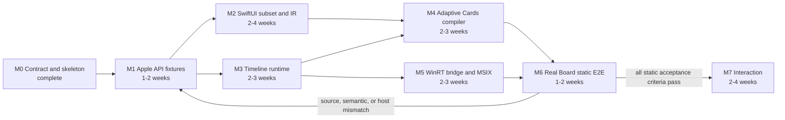

# OpenWidgetKit Implementation Progress

## Current state

| Area | Status | Evidence |
|---|---|---|
| package/module boundary | Implemented in source | `Package.swift` and one-way target dependencies |
| requirements | Documented | `REQUIREMENTS.md` |
| runtime specification | Documented | `SPECIFICATION.md` |
| architecture decisions | Documented | `DESIGN.md` |
| Windows constraints | Documented | `WINDOWS_NOTES.md` |
| Foundation/geometry ownership | Implemented and verified except Windows | OpenFoundation owns the canonical CFCG boundary and re-exports toolchain Foundation on full Swift |
| public SwiftUI API | Foundation slice only | `EnvironmentValues` substrate; View/Widget surface remains incomplete |
| public WidgetKit API | Foundation slice only | initial timeline entry/provider/value/context/family declarations |
| runtime behavior | Foundation slice only | finite, nonempty, ordered timeline and reload-date validation |
| Windows provider | Not implemented | no bridge or packaging target exists |
| build/test/runtime verification | Native and normal WASM passed | 12 Native tests, Apple system-module compile fixture, and normal WASM target build; Windows remains unverified |

Import-only success, declaration presence, or Package.swift resolution is not implementation evidence.

## Current foundational slice

```text
WidgetKit Timeline<Entry>
    -> package lowering
        -> OpenWidgetRuntime TimelineValidator
            -> ValidatedTimeline
            -> future TimelineScheduler
```

Source behavior tests cover accepted timelines, empty timelines, nonfinite dates,
out-of-order entries, reload dates, entry relevance, public value storage, canonical CFCG values, and the Apple-compatible
`EnvironmentVariants` key-path subscript call shape. All 12 Native tests passed on 2026-08-20, the initial timeline
surface typechecked against Apple system Foundation/SwiftUI/WidgetKit, and the normal WASM target built with the pinned
Swift 6.4 snapshot. Windows compilation and real Widgets Board behavior remain unverified.

## Milestone dependency graph



Estimates are planning ranges for one experienced engineer, not completion claims. The critical path is
M1 -> M2/M3 -> M4/M5 -> M6. The M6 loop converges only when the same source compiles and the real
Widgets Board exercises successful and failed lifecycle paths.

## M0: Contract and package skeleton

- [x] Create standalone SwiftPM package directory
- [x] Define public `SwiftUI` product/module
- [x] Define public `WidgetKit` product/module
- [x] Define package-internal `OpenWidgetRuntime` target
- [x] Document source compatibility objective
- [x] Document module responsibility boundary
- [x] Document platform condition versus trait/macro decision
- [x] Document host-neutral `WidgetDocument`
- [x] Document Windows COM/MSIX/Adaptive Cards constraints
- [x] Document toolchain Foundation and geometry ownership
- [x] Add the OpenFoundation package dependency and re-export source boundary
- [x] Mark callable implementation as incomplete
- [ ] Initialize a Git repository
- [ ] Select remote repository and release policy

Git initialization and remote creation are intentionally not performed by the package skeleton task.
OpenFoundation wiring is verified on Native and normal WASM. Windows compile/link verification is pending.
OpenWidgetKit does not advertise Embedded Swift support: its current Apple-compatible surface contains `Codable`,
which the pinned Embedded Swift mode does not provide.

## M1: Apple API inventory and compatibility fixtures

No public declaration may be added before its inventory row is complete.

| Family | SDK signature | Apple compile fixture | Availability/isolation | Status |
|---|---|---|---|---|
| `Widget` | reviewed, fixture not stored | missing | reviewed | planned |
| `WidgetConfiguration` | reviewed, fixture not stored | missing | reviewed | planned |
| `WidgetBundle` | partially reviewed | missing | incomplete | planned |
| `StaticConfiguration` | reviewed, fixture not stored | missing | reviewed | planned |
| `TimelineEntry` | reviewed for initial date/relevance surface | replacement tests and Apple compile fixture pass | initial baseline reviewed | initial slice verified on Native/WASM |
| `TimelineProvider` | reviewed against SDK interface | replacement conformance test and Apple call-shape fixture pass | callback `@Sendable` reviewed | initial slice verified on Native/WASM |
| `TimelineProviderContext` | reviewed against SDK interface | replacement geometry/key-path tests and Apple compile fixture pass | initial properties reviewed | initial slice verified on Native/WASM |
| `Timeline` | reviewed against SDK interface | replacement behavior tests and Apple compile fixture pass | reviewed | initial slice verified on Native/WASM |
| `TimelineReloadPolicy` | reviewed against SDK interface | replacement behavior tests pass; Apple fixture missing | reviewed | initial slice verified on Native/WASM |
| `WidgetFamily` | reviewed for initial small/medium/large surface | replacement behavior test passes; Apple fixture missing | initial baseline reviewed | initial slice verified on Native/WASM |
| `WidgetCenter` | reviewed, fixture not stored | missing | reviewed | planned |

Required work:

- [ ] Pin an exact Apple SDK/Xcode baseline
- [ ] Store extracted public interface fixtures permitted by licensing/policy
- [ ] Create Apple compile fixtures for canonical widget sources
- [ ] Record generic constraints and opaque return behavior
- [ ] Record actor isolation and `@Sendable` completion behavior
- [ ] Define initial availability baseline
- [ ] Define explicit out-of-scope API families
- [ ] Pin the exact Windows Foundation module/runtime baseline with the Swift toolchain
- [ ] Add Apple/Windows compile fixtures using `Date`, `CGFloat`, `CGSize`, and `CGRect`
- [ ] Verify non-Embedded OpenCoreGraphics values cross the OpenWidgetKit API without conversion
- [x] Verify the intended Foundation re-export and public-import surface on Native and normal WASM; Windows remains pending

## M2: Widget-scoped SwiftUI and semantic document

- [ ] `View` protocol and builder contract
- [ ] conditional/tuple/group content
- [ ] `Text`
- [ ] limited `Image`
- [ ] `VStack`
- [ ] `HStack`
- [ ] `Spacer`
- [ ] `Divider`
- [ ] stable-identity `ForEach`
- [ ] font/color/padding/frame/background/line-limit subset
- [ ] widget environment snapshot
- [ ] immutable `WidgetDocument`
- [ ] stable node/action/resource identities
- [ ] unsupported View/modifier typed errors
- [ ] success and failure behavior tests for every supported declaration

Canvas, Path, ZStack, gradient, animation, general application navigation, and responder APIs remain
unadvertised until a later milestone defines their semantics.

## M3: WidgetKit configuration and timeline runtime

- [ ] `Widget` bootstrap into runtime registration
- [ ] `WidgetConfiguration` internal lowering contract
- [ ] `StaticConfiguration`
- [ ] immutable widget registry and duplicate-kind failure
- [x] `TimelineEntry` declaration and default relevance (Native/WASM verified)
- [x] `TimelineProvider` callback declaration (Native/WASM verified)
- [ ] one-shot completion ownership
- [ ] timeout/duplicate/late completion failures
- [x] `Timeline` value and validation lowering (Native/WASM verified)
- [x] `TimelineReloadPolicy` value and runtime lowering (Native/WASM verified)
- [ ] `.atEnd`, `.after`, `.never` scheduler semantics
- [x] Initial `WidgetFamily` values and context value surface (Native/WASM verified)
- [ ] Host `WidgetFamily` context mapping
- [ ] `WidgetCenter` reload behavior
- [ ] instance generation and stale result rejection
- [ ] shutdown/cancellation behavior
- [ ] concurrent reload/delete/action tests

## M4: Adaptive Cards compiler

- [ ] canonical JSON encoder contract
- [ ] `WidgetDocument` validation
- [ ] structural hash
- [ ] template/data separation
- [ ] TextBlock mapping
- [ ] Image/resource mapping
- [ ] vertical Container mapping
- [ ] horizontal ColumnSet mapping
- [ ] family/theme host conditions
- [ ] explicit unsupported semantic errors
- [ ] template cache ownership and eviction
- [ ] golden success fixtures
- [ ] malformed/unsupported failure fixtures

## M5: Windows host bridge and packaging

- [ ] Pin Swift/Windows SDK/Windows App SDK/C++ toolset versions
- [ ] Record Foundation/runtime library versions and dynamic/static link mode
- [ ] Package only Foundation/runtime libraries from the compiler toolchain
- [ ] Reject mixed Foundation module/runtime versions during packaging validation
- [ ] Define narrow C ABI
- [ ] Implement C++/WinRT `IWidgetProvider`
- [ ] Copy callback values within callback scope
- [ ] Implement COM class factory lifetime
- [ ] Keep Swift `Widget.main()` as the only process entry point
- [ ] Implement host update and typed rejection path
- [ ] Define JSON/resource owner and exactly-once deallocator
- [ ] Create MSIX packaging project/tooling
- [ ] Register COM server and Widget Provider extension
- [ ] Validate CLSID/kind/family/resource metadata
- [ ] Build/link x64
- [ ] Build/link arm64

## M6: Real Windows Widgets Board static E2E

- [ ] Install signed development MSIX
- [ ] Discover widget in gallery
- [ ] Pin widget
- [ ] Exercise `CreateWidget`
- [ ] Exercise `Activate`/`Deactivate`
- [ ] Render small/medium/large
- [ ] Render light/dark themes
- [ ] Update timeline entries
- [ ] Exercise `.atEnd`, `.after`, `.never`
- [ ] Exercise `WidgetCenter` reload
- [ ] Exercise context changes during provider work
- [ ] Exercise delete during provider work
- [ ] Verify malformed payload failure remains observable
- [ ] Verify process shutdown and resource release
- [ ] Compile the exact same source against Apple system modules

## M7: Interaction

- [ ] Define supported SwiftUI interaction surface
- [ ] Stable action identity and payload
- [ ] `Action.Execute` compilation
- [ ] `OnActionInvoked` routing
- [ ] Unknown, duplicate, stale action failures
- [ ] Action-triggered timeline invalidation
- [ ] Callback reentrancy tests
- [ ] Decide App Intents compatibility boundary

## Future milestones

- richer layout and style mapping;
- accessibility and localization conformance;
- image rasterization through OpenCoreGraphics after Windows verification;
- provider customization;
- App Intents-compatible interaction;
- Web/WASI host adapter;
- remote HTML Widget backend;
- diagnostics and developer preview tooling。

## Completion evidence policy

Every completed row must link to or name evidence for:

1. public signature or internal contract;
2. concrete production implementation path;
3. successful behavior test;
4. failed behavior test;
5. applicable concurrency/lifetime test;
6. target compile/link evidence;
7. real host evidence when a platform adapter is involved。

Before removing any `FIXME(INCOMPLETE_IMPLEMENTATION)` marker, update this document in the same change.
An unsupported API must remain undeclared or return an explicit typed failure according to its public contract;
it must not return placeholder data and claim success.
