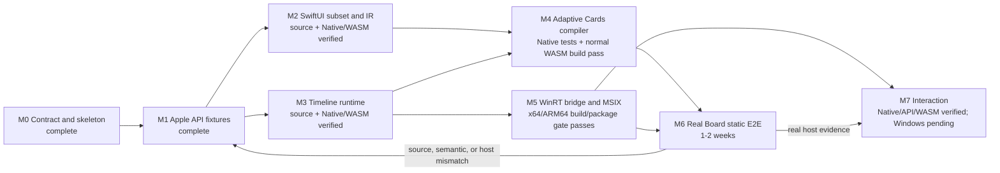

# OpenWidgetKit Implementation Progress

## Current state

| Area | Status | Evidence |
|---|---|---|
| package/module boundary | Implemented in source | `Package.swift` and one-way target dependencies |
| requirements | Documented | `REQUIREMENTS.md` |
| runtime specification | Documented | `SPECIFICATION.md` |
| architecture decisions | Documented | `DESIGN.md` |
| M1 API baseline | Complete and verified | `API_COMPATIBILITY.md`, both M1 verification scripts, and `Verification/M1_WINDOWS_EVIDENCE.json` |
| Windows constraints | Documented | `WINDOWS_NOTES.md` |
| Foundation/geometry ownership | Implemented; Native, normal WASM, and Windows verified | OpenFoundation owns the canonical CFCG boundary; M1 verifies x64 identity/behavior and M5 compiles the full test graph and packages architecture-matched Foundation runtimes on x64/ARM64 |
| public SwiftUI API | M2 implemented; Native/WASM behavior and Windows x64/ARM64 compilation verified | widget-scoped View DSL, builders, Widget protocols, environment, and semantic lowering |
| public WidgetKit API | host-neutral M3 implemented; Native/WASM behavior and Windows x64/ARM64 compilation verified | static configuration, provider bridge, registry bootstrap, and WidgetCenter routing |
| runtime behavior | host-neutral M3 implemented | provider ownership, validation, three reload policies, generation fences, cancellation, and shutdown |
| Adaptive Cards compiler | M4 host-neutral implementation verified on Native and normal WASM | canonical encoder, structural identity/cache, theme/family templates, resources, mappings, typed failures, 12 Native tests, and the normal WASM target build |
| Windows provider | M5 source and x64/ARM64 build/package gate verified; runtime pending M6 | C ABI, C++/WinRT provider, async Swift bootstrap, generation fences, configuration, manifest generator, native-architecture packaging workflow, 13 Native host/manifest/controller tests, and expanded MSIX evidence |
| interaction | M7 host-neutral behavior and API surface verified; Windows pending | bounded AppIntents product, deferred localized-resource resolution, stable logical/environment action bindings, session/instance/accepted-entry fences, nonblocking intent monitoring, typed failures, success-triggered reload, Native behavior tests, Apple/replacement fixtures, and normal WASM target builds |
| build/test/runtime verification | Native, normal WASM, Windows M1, and Windows M5 build/package gates pass | all 97 focused Native tests pass, pinned Apple/replacement API verification passes, normal WASM API/compiler builds and behavior fixtures pass, M1 x64 behavior passes, and the recorded M5 x64/ARM64 compile/link/package gates pass; the revised Windows workflow, COM activation, and real Widgets Board runtime remain unexecuted |

The 2026-08-20 architectural review corrected inactive lifecycle handling,
delete/recreate generation continuity, template reset across instance lifetimes,
retained-content-aware inactive recovery,
shutdown completion retry state, accepted-invalidation/fail-closed-removal host
fences, startup recovery ordering, the documented Widget Provider
`no_module_lock` class-factory boundary, a zero-allocation shutdown callback,
the C++ delete/update reentrancy boundary,
typed C ABI status preservation, bounded transactional view identity retention,
binding-plan-driven data-only template-cache hits with overflow-free bounded LRU ordering,
single-source resource URI derivation, and
the packaged-COM namespace declaration. Fifteen focused regression test
declarations were added, and the host-fence and manifest tests were
strengthened. All 97 Native tests and the affected normal WASM targets pass.
The recorded native Windows x64/ARM64 gates compile the full Swift test graph,
build the provider executable and C++/WinRT bridge, prove the official runtime
dependency closure, and inspect the expanded unsigned MSIX. The revised
push/pull-request workflow also executes the compiled test runner with a
ten-minute timeout and resolves OpenFoundation from its pinned remote revision;
that revised path has not run yet.

Import-only success, declaration presence, or Package.swift resolution is not implementation evidence.

## Current implemented path

```text
Widget / WidgetBundle
    -> StaticConfiguration
        -> one-shot TimelineProvider bridge
            -> immutable WidgetDocument entries
                -> generation-safe TimelineScheduler
                    -> RuntimeWidgetHost generation fence
                        -> Adaptive Cards template/data compiler
                            -> Swift host actor and C ABI generation fence
                                -> C++/WinRT IWidgetProvider
                                    -> WidgetManager.UpdateWidget

AppIntent-backed Button
    -> WidgetAction in the semantic document
        -> environment-qualified Action.Execute
            -> owned OnActionInvoked event
                -> accepted generation/revision action table
                    -> AppIntent.perform()
                        -> next timeline generation
```

The 97 focused Native tests cover the initial timeline values plus semantic
lowering, stable identities, resource ownership, invalid values, provider
completion ownership, timeout/duplicate/late completion, all three scheduler
policies, non-advancing reload rejection, registry failures, bootstrap routing,
WidgetCenter routing, generation invalidation, delete during a suspended host
apply, shutdown, canonical Adaptive Cards success/failure payloads, template
cache behavior, host generation fences, deterministic manifest generation,
bounded callback overflow, interaction replay fences, nonblocking action
execution, owner release, typed diagnostics, and success-only timeline reload.
The M2/M3/M7 shared source fixtures typecheck against the pinned Apple SDKs and
the replacement. The replacement API fixture, behavior fixture, and M4 compiler
target build for normal WASM with the pinned Swift 6.4 snapshot and the published
OpenFoundation localized-value supplement. The x86_64 Windows M1 gate
executes its behavior fixture and verifies Foundation module/runtime identity.
The recorded M5 gate compiles M2-M5 test
targets and builds, links, and packages the provider on native x64 and ARM64
runners. It does not execute the Windows host lifecycle or Widgets Board
behavior. The revised workflow is intended to execute the compiled package
tests, but remains pending its first run.

## Milestone dependency graph



Estimates are planning ranges for one experienced engineer, not completion claims. The critical path is
M1 -> M2/M3 -> M4/M5 -> M6. The M6 loop converges only when the same source compiles and the real
Widgets Board exercises successful and failed lifecycle paths.

## M0: Contract and package skeleton

- [x] Create standalone SwiftPM package directory
- [x] Define public `SwiftUI` product/module
- [x] Define public `WidgetKit` product/module
- [x] Define package-internal `OpenWidgetRuntime` target
- [x] Document source compatibility objective
- [x] Document module responsibility boundary
- [x] Document platform condition versus trait/macro decision
- [x] Document host-neutral `WidgetDocument`
- [x] Document Windows COM/MSIX/Adaptive Cards constraints
- [x] Document toolchain Foundation and geometry ownership
- [x] Add the OpenFoundation package dependency and re-export source boundary
- [x] Mark callable implementation as incomplete
- [x] Initialize a Git repository
- [x] Select the `1amageek/OpenWidgetKit` remote repository; release policy remains milestone-gated

OpenFoundation wiring is verified on Native, normal WASM, and pinned x86_64 Windows.
OpenWidgetKit does not advertise Embedded Swift support: its current Apple-compatible surface contains `Codable`,
which the pinned Embedded Swift mode does not provide.

## M1: Apple API inventory and compatibility fixtures

No public declaration may be added before its inventory row is complete.

| Family | SDK signature | Apple compile fixture | Availability/isolation | Status |
|---|---|---|---|---|
| `Widget` | pinned SDK declaration recorded | canonical Apple static-widget fixture passes | `@MainActor @preconcurrency`; exact baseline recorded | inventory complete; implementation M2/M3 |
| `WidgetConfiguration` | pinned SDK declaration and graph requirement recorded | exercised by both canonical Apple fixtures | `@MainActor @preconcurrency`; opaque body recorded | inventory complete; implementation M2/M3 |
| `WidgetBundle` | pinned SDK declaration recorded | canonical Apple bundle fixture passes | builder and `@MainActor @preconcurrency` recorded | inventory complete; implementation M3 |
| `StaticConfiguration` | generic initializer and opaque body recorded | canonical Apple static-widget and bundle fixtures pass | `@MainActor @preconcurrency`; current `Sendable` conformance recorded | inventory complete; implementation M2/M3 |
| `TimelineEntry` | exact initial date/relevance surface recorded | shared Apple/replacement fixture and behavior tests pass | exact initial availability applied | initial slice verified on Native, normal WASM, and Windows |
| `TimelineProvider` | exact initial generic and callback surface recorded | shared Apple/replacement fixture and conformance test pass | callback `@preconcurrency`/`@Sendable` recorded | declaration verified on Native, normal WASM, and Windows; ownership M3 |
| `TimelineProviderContext` | exact initial properties and key-path subscripts recorded | Apple/replacement geometry and key-path fixtures pass | exact initial availability applied | initial value slice verified on Native, normal WASM, and Windows |
| `Timeline` | exact generic constraint, storage, and initializer recorded | shared Apple/replacement fixture and behavior tests pass | exact initial availability applied | initial slice verified on Native, normal WASM, and Windows |
| `TimelineReloadPolicy` | exact `Equatable`-only surface recorded | positive behavior and Apple/replacement negative-conformance fixtures pass | exact initial availability applied | initial slice verified on Native, normal WASM, and Windows |
| `WidgetFamily` | exact conformances and first three cases recorded | shared Apple/replacement fixture and behavior test pass | type and case availability applied | initial slice verified on Native, normal WASM, and Windows |
| `WidgetCenter` | exact initial singleton/query/reload surface recorded | Apple compile fixture passes | callback `@preconcurrency`/`@Sendable` recorded | inventory complete; implementation M3 |

Required work:

- [x] Pin the exact Apple SDK/Xcode/compiler/interface-hash baseline
- [x] Store normalized public signature inventory without copying complete SDK interfaces
- [x] Create Apple compile fixtures for canonical widget and widget-bundle sources
- [x] Record generic constraints and opaque return behavior
- [x] Record actor isolation and `@Sendable` completion behavior
- [x] Define the initial availability baseline
- [x] Define explicit out-of-scope API families
- [x] Pin the exact Windows Swift installer and Foundation/runtime distribution baseline
- [x] Add one shared Apple/replacement compile fixture using `Date`, `CGFloat`, `CGPoint`, `CGSize`, and `CGRect`
- [x] Verify non-Embedded OpenCoreGraphics values cross the OpenWidgetKit API without conversion on macOS and normal WASM
- [x] Verify the intended Foundation re-export and public-import surface on Native, normal WASM, and pinned x86_64 Windows
- [ ] Run the automatic push/PR Windows workflow that executes the compiled test runner and resolves the pinned remote OpenFoundation revision; workflow source is implemented but its first run is pending
- [x] Run `scripts/verify-m1-windows.ps1` on the pinned x86_64 Windows toolchain and record installed Foundation artifact hashes

## M2: Widget-scoped SwiftUI and semantic document

- [x] `View` protocol and variadic builder contract
- [x] conditional/tuple/group/erased content
- [x] `Text`
- [x] limited `Image` with a semantic resource table
- [x] `VStack`
- [x] `HStack`
- [x] `Spacer`
- [x] `Divider`
- [x] stable-identity `ForEach`
- [x] font/color/padding/frame/background/line-limit subset
- [x] widget environment snapshot
- [x] immutable `WidgetDocument`
- [x] stable node and resource identities
- [x] unsupported View/modifier typed errors
- [x] success and failure behavior tests for the supported semantic surface
- [x] Compile the M2 source and test graph on the pinned x64 and ARM64 Windows toolchains
- [ ] Execute the M2 behavior tests on Windows

Action identity belongs to M7 because M2 deliberately declares no interaction
surface. Adding an unused action type in M2 would create a contract without a
producer or consumer.

Canvas, Path, ZStack, gradient, animation, general application navigation, and responder APIs remain
unadvertised until a later milestone defines their semantics.

## M3: WidgetKit configuration and timeline runtime

- [x] `Widget` and `WidgetBundle` lowering into an installed runtime bootstrap
- [x] `WidgetConfiguration` internal lowering contract
- [x] `StaticConfiguration`
- [x] immutable widget registry and duplicate-kind failure
- [x] `TimelineEntry` declaration and default relevance (Native/WASM/Windows verified)
- [x] `TimelineProvider` callback declaration (Native/WASM/Windows verified)
- [x] one-shot completion ownership
- [x] timeout/duplicate/late completion failures
- [x] `Timeline` value and validation lowering (Native/WASM/Windows verified)
- [x] `TimelineReloadPolicy` value and runtime lowering (Native/WASM/Windows verified)
- [x] `.atEnd`, `.after`, `.never` scheduler semantics
- [x] Initial `WidgetFamily` values and context value surface (Native/WASM/Windows verified)
- [x] Host `WidgetFamily` context mapping
- [x] `WidgetCenter` query and reload routing
- [x] instance generation and stale result rejection at provider and host commit boundaries
- [x] active/inactive state with initial inactive creation content, inactive recovery deferral, deactivation cancellation, and explicit inactive reload support
- [x] monotonic generation tombstones across delete/recreate lifetimes
- [x] shutdown/cancellation behavior
- [x] reload/delete race and suspended-host-apply tests
- [x] Compile the M3 source and test graph on the pinned x64 and ARM64 Windows toolchains
- [ ] Execute the M3 behavior tests on Windows

Windows `Widget.main()` installs the M5 bootstrap before lowering reaches the
runtime composition. Other platforms without an injected host still fail with
`hostUnavailable` instead of reporting placeholder success. M7 now routes the
owned `OnActionInvoked` value through the accepted entry-revision action table;
provider-session and instance-scoped state prevents cross-lifetime replay,
logical action identity fences environment variants together, attempted revisions
are never reused, suspended intent completion does not block lifecycle event draining,
and unknown, malformed, duplicate, and stale actions fail explicitly.

## M4: Adaptive Cards compiler

- [x] canonical JSON encoder contract implemented
- [x] `WidgetDocument` validation implemented
- [x] stable SHA-256 structural identity implemented
- [x] template/data separation implemented
- [x] TextBlock mapping implemented
- [x] Image/resource mapping implemented for configured `ms-appx:///` assets
- [x] vertical Container mapping implemented
- [x] horizontal ColumnSet mapping implemented
- [x] family/theme host conditions implemented
- [x] explicit unsupported semantic errors implemented
- [x] bounded `Mutex`-owned template cache and LRU eviction implemented
- [x] golden success fixtures added
- [x] malformed/unsupported failure fixtures added
- [x] Execute 12 M4 Native tests and record canonical payload evidence in the golden fixtures
- [x] Build the M4 target for normal WASM with the pinned Swift 6.4 snapshot and matching SDK
- [ ] validate visual mapping in the real Widgets Board (M6)

## M5: Windows host bridge and packaging

- [x] Pin Swift/Windows SDK/Windows App SDK/C++ toolset versions in provider configuration
- [x] Record dynamic Foundation/runtime link mode and pin the WiX packaging SDK
- [x] Package the target architecture's official Swift private redistributable merge module
- [x] Reject architecture drift and incomplete Swift/Foundation dependency closure during packaging
- [x] Define narrow C ABI
- [x] Implement all six C++/WinRT `IWidgetProvider` callbacks
- [x] Copy callback values within callback scope
- [x] Implement COM class factory and module-lock shutdown handshake
- [x] Keep async Swift `Widget.main()` as the only process entry point
- [x] Implement host update and typed rejection path
- [x] Define event/result owners and exactly-once release callbacks
- [x] Create deterministic MSIX manifest and packaging tooling
- [x] Register COM server and Widget Provider extension from one configuration
- [x] Validate CLSID/kind/family/resource metadata and derive resource URIs from canonical paths
- [x] Add native `windows-2025-vs2026` x64 and `windows-11-vs2026-arm` ARM64 build jobs
- [x] Execute 13 Native tests for host generation fences, controller lifecycle, typed bridge status, and deterministic manifest generation
- [x] Execute the new inactive lifecycle, recreation, shutdown-retry, transactional-fence, identity-retention, LRU, and complete-template regression tests
- [x] Build/link x64
- [x] Build/link arm64
- [x] Inspect expanded MSIX contents and record M5 evidence

## M6: Real Windows Widgets Board static E2E

- [ ] Install signed development MSIX
- [ ] Discover widget in gallery
- [ ] Pin widget
- [ ] Exercise `CreateWidget`
- [ ] Exercise `Activate`/`Deactivate`
- [ ] Render small/medium/large
- [ ] Render light/dark themes
- [ ] Update timeline entries
- [ ] Exercise `.atEnd`, `.after`, `.never`
- [ ] Exercise `WidgetCenter` reload
- [ ] Exercise context changes during provider work
- [ ] Exercise delete during provider work
- [ ] Verify malformed payload failure remains observable
- [ ] Verify process shutdown and resource release
- [ ] Compile the exact same source against Apple system modules

## M7: Interaction

- [x] Define the supported SwiftUI interaction surface and verify the shared Apple/replacement fixture
- [x] Verify stable action identity, environment verbs, provider-session/instance-scoped accepted-entry revisions, and non-reused attempted revisions on Native
- [x] Verify `ActionSet`/`Action.Execute` compilation and canonical bindings on Native and build the compiler for normal WASM
- [ ] Execute owned `OnActionInvoked` routing in the real Windows host; ordered validation/reservation and nonblocking completion are verified on Native
- [x] Verify typed unknown, duplicate, malformed, and stale action failures on Native
- [x] Verify success-only expected-generation timeline invalidation on Native
- [x] Verify logical-action duplicate, generation-change, instance/session scope, bridge-failure, nonblocking delete/shutdown, and non-retaining suspended execution
- [x] Record the bounded App Intents compatibility boundary in ADR-007 and verify its shared fixture

## Future milestones

- richer layout and style mapping;
- accessibility and localization conformance;
- image rasterization through OpenCoreGraphics after Windows verification;
- provider customization;
- App Intent parameters, entities, discovery, donation, and foreground execution;
- Web/WASI host adapter;
- remote HTML Widget backend;
- diagnostics and developer preview tooling.

## Completion evidence policy

Every completed row must link to or name evidence for:

1. public signature or internal contract;
2. concrete production implementation path;
3. successful behavior test;
4. failed behavior test;
5. applicable concurrency/lifetime test;
6. target compile/link evidence;
7. real host evidence when a platform adapter is involved.

Before removing any `FIXME(INCOMPLETE_IMPLEMENTATION)` marker, update this document in the same change.
An unsupported API must remain undeclared or return an explicit typed failure according to its public contract;
it must not return placeholder data and claim success.
