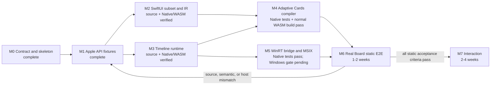

# OpenWidgetKit Implementation Progress

## Current state

| Area | Status | Evidence |
|---|---|---|
| package/module boundary | Implemented in source | `Package.swift` and one-way target dependencies |
| requirements | Documented | `REQUIREMENTS.md` |
| runtime specification | Documented | `SPECIFICATION.md` |
| architecture decisions | Documented | `DESIGN.md` |
| M1 API baseline | Complete and verified | `API_COMPATIBILITY.md`, both M1 verification scripts, and `Verification/M1_WINDOWS_EVIDENCE.json` |
| Windows constraints | Documented | `WINDOWS_NOTES.md` |
| Foundation/geometry ownership | Implemented; Native and normal WASM verified, Windows pending | OpenFoundation owns the canonical CFCG boundary and re-exports toolchain Foundation on full Swift; the current OpenWidgetKit Windows graph has not been rebuilt |
| public SwiftUI API | M2 implemented in source | widget-scoped View DSL, builders, Widget protocols, environment, and semantic lowering |
| public WidgetKit API | host-neutral M3 implemented in source | static configuration, provider bridge, registry bootstrap, and WidgetCenter routing |
| runtime behavior | host-neutral M3 implemented | provider ownership, validation, three reload policies, generation fences, cancellation, and shutdown |
| Adaptive Cards compiler | M4 host-neutral implementation verified on Native and normal WASM | canonical encoder, structural identity/cache, theme/family templates, resources, mappings, typed failures, 12 Native tests, and the normal WASM target build |
| Windows provider | M5 host-neutral Swift surface verified on Native; Windows target verification pending | C ABI, C++/WinRT provider, async Swift bootstrap, generation fences, configuration, manifest generator, packaging workflow, and 12 Native host/manifest/controller tests |
| build/test/runtime verification | Review changes verified on Native and normal WASM; Windows workflow pending | all 74 focused Native tests pass, the Windows runtime target passes three consecutive warm runs, and the pinned 2026-08-14 normal WASM targets build; x64/ARM64 and real Windows runtime remain unexecuted |

The 2026-08-20 architectural review corrected inactive lifecycle handling,
delete/recreate generation continuity, template reset across instance lifetimes,
retained-content-aware inactive recovery,
shutdown completion retry state, accepted-invalidation/fail-closed-removal host
fences, startup recovery ordering, the documented Widget Provider
`no_module_lock` class-factory boundary, a zero-allocation shutdown callback,
the C++ delete/update reentrancy boundary,
typed C ABI status preservation, bounded transactional view identity retention,
binding-plan-driven data-only template-cache hits with overflow-free bounded LRU ordering,
single-source resource URI derivation, and
the packaged-COM namespace declaration. Fifteen focused regression test
declarations were added, and the host-fence and manifest tests were
strengthened. All 74 Native tests and the affected normal WASM targets pass;
Windows x64/ARM64 build/link evidence remains pending.

Import-only success, declaration presence, or Package.swift resolution is not implementation evidence.

## Current implemented path

```text
Widget / WidgetBundle
    -> StaticConfiguration
        -> one-shot TimelineProvider bridge
            -> immutable WidgetDocument entries
                -> generation-safe TimelineScheduler
                    -> RuntimeWidgetHost generation fence
                        -> Adaptive Cards template/data compiler
                            -> Swift host actor and C ABI generation fence
                                -> C++/WinRT IWidgetProvider
                                    -> WidgetManager.UpdateWidget
```

The current 74 focused Native test declarations cover the initial timeline values plus semantic
lowering, stable identities, resource ownership, invalid values, provider
completion ownership, timeout/duplicate/late completion, all three scheduler
policies, non-advancing reload rejection, registry failures, bootstrap routing,
WidgetCenter routing, generation invalidation, delete during a suspended host
apply, shutdown, canonical Adaptive Cards success/failure payloads, template
cache behavior, host generation fences, and deterministic manifest generation.
The M2/M3 shared source fixture typechecks against the
pinned Apple SDKs and the replacement, and the replacement fixture builds for
normal WASM with the pinned Swift 6.4 snapshot. The M4 target also builds for
normal WASM. The existing x86_64 Windows gate covers M1 only; M2-M5 Windows
compile/link/runtime evidence has not yet been produced.

## Milestone dependency graph



Estimates are planning ranges for one experienced engineer, not completion claims. The critical path is
M1 -> M2/M3 -> M4/M5 -> M6. The M6 loop converges only when the same source compiles and the real
Widgets Board exercises successful and failed lifecycle paths.

## M0: Contract and package skeleton

- [x] Create standalone SwiftPM package directory
- [x] Define public `SwiftUI` product/module
- [x] Define public `WidgetKit` product/module
- [x] Define package-internal `OpenWidgetRuntime` target
- [x] Document source compatibility objective
- [x] Document module responsibility boundary
- [x] Document platform condition versus trait/macro decision
- [x] Document host-neutral `WidgetDocument`
- [x] Document Windows COM/MSIX/Adaptive Cards constraints
- [x] Document toolchain Foundation and geometry ownership
- [x] Add the OpenFoundation package dependency and re-export source boundary
- [x] Mark callable implementation as incomplete
- [x] Initialize a Git repository
- [x] Select the `1amageek/OpenWidgetKit` remote repository; release policy remains milestone-gated

OpenFoundation wiring is verified on Native, normal WASM, and pinned x86_64 Windows.
OpenWidgetKit does not advertise Embedded Swift support: its current Apple-compatible surface contains `Codable`,
which the pinned Embedded Swift mode does not provide.

## M1: Apple API inventory and compatibility fixtures

No public declaration may be added before its inventory row is complete.

| Family | SDK signature | Apple compile fixture | Availability/isolation | Status |
|---|---|---|---|---|
| `Widget` | pinned SDK declaration recorded | canonical Apple static-widget fixture passes | `@MainActor @preconcurrency`; exact baseline recorded | inventory complete; implementation M2/M3 |
| `WidgetConfiguration` | pinned SDK declaration and graph requirement recorded | exercised by both canonical Apple fixtures | `@MainActor @preconcurrency`; opaque body recorded | inventory complete; implementation M2/M3 |
| `WidgetBundle` | pinned SDK declaration recorded | canonical Apple bundle fixture passes | builder and `@MainActor @preconcurrency` recorded | inventory complete; implementation M3 |
| `StaticConfiguration` | generic initializer and opaque body recorded | canonical Apple static-widget and bundle fixtures pass | `@MainActor @preconcurrency`; current `Sendable` conformance recorded | inventory complete; implementation M2/M3 |
| `TimelineEntry` | exact initial date/relevance surface recorded | shared Apple/replacement fixture and behavior tests pass | exact initial availability applied | initial slice verified on Native, normal WASM, and Windows |
| `TimelineProvider` | exact initial generic and callback surface recorded | shared Apple/replacement fixture and conformance test pass | callback `@preconcurrency`/`@Sendable` recorded | declaration verified on Native, normal WASM, and Windows; ownership M3 |
| `TimelineProviderContext` | exact initial properties and key-path subscripts recorded | Apple/replacement geometry and key-path fixtures pass | exact initial availability applied | initial value slice verified on Native, normal WASM, and Windows |
| `Timeline` | exact generic constraint, storage, and initializer recorded | shared Apple/replacement fixture and behavior tests pass | exact initial availability applied | initial slice verified on Native, normal WASM, and Windows |
| `TimelineReloadPolicy` | exact `Equatable`-only surface recorded | positive behavior and Apple/replacement negative-conformance fixtures pass | exact initial availability applied | initial slice verified on Native, normal WASM, and Windows |
| `WidgetFamily` | exact conformances and first three cases recorded | shared Apple/replacement fixture and behavior test pass | type and case availability applied | initial slice verified on Native, normal WASM, and Windows |
| `WidgetCenter` | exact initial singleton/query/reload surface recorded | Apple compile fixture passes | callback `@preconcurrency`/`@Sendable` recorded | inventory complete; implementation M3 |

Required work:

- [x] Pin the exact Apple SDK/Xcode/compiler/interface-hash baseline
- [x] Store normalized public signature inventory without copying complete SDK interfaces
- [x] Create Apple compile fixtures for canonical widget and widget-bundle sources
- [x] Record generic constraints and opaque return behavior
- [x] Record actor isolation and `@Sendable` completion behavior
- [x] Define the initial availability baseline
- [x] Define explicit out-of-scope API families
- [x] Pin the exact Windows Swift installer and Foundation/runtime distribution baseline
- [x] Add one shared Apple/replacement compile fixture using `Date`, `CGFloat`, `CGPoint`, `CGSize`, and `CGRect`
- [x] Verify non-Embedded OpenCoreGraphics values cross the OpenWidgetKit API without conversion on macOS and normal WASM
- [x] Verify the intended Foundation re-export and public-import surface on Native, normal WASM, and pinned x86_64 Windows
- [x] Add a dispatch-only Windows workflow pinned to the Swift installer SHA-256, action commits, and sibling-package commits
- [x] Run `scripts/verify-m1-windows.ps1` on the pinned x86_64 Windows toolchain and record installed Foundation artifact hashes

## M2: Widget-scoped SwiftUI and semantic document

- [x] `View` protocol and variadic builder contract
- [x] conditional/tuple/group/erased content
- [x] `Text`
- [x] limited `Image` with a semantic resource table
- [x] `VStack`
- [x] `HStack`
- [x] `Spacer`
- [x] `Divider`
- [x] stable-identity `ForEach`
- [x] font/color/padding/frame/background/line-limit subset
- [x] widget environment snapshot
- [x] immutable `WidgetDocument`
- [x] stable node and resource identities
- [x] unsupported View/modifier typed errors
- [x] success and failure behavior tests for the supported semantic surface
- [ ] Re-run the M2 compile and behavior gates on the pinned Windows toolchain

Action identity belongs to M7 because M2 deliberately declares no interaction
surface. Adding an unused action type in M2 would create a contract without a
producer or consumer.

Canvas, Path, ZStack, gradient, animation, general application navigation, and responder APIs remain
unadvertised until a later milestone defines their semantics.

## M3: WidgetKit configuration and timeline runtime

- [x] `Widget` and `WidgetBundle` lowering into an installed runtime bootstrap
- [x] `WidgetConfiguration` internal lowering contract
- [x] `StaticConfiguration`
- [x] immutable widget registry and duplicate-kind failure
- [x] `TimelineEntry` declaration and default relevance (Native/WASM/Windows verified)
- [x] `TimelineProvider` callback declaration (Native/WASM/Windows verified)
- [x] one-shot completion ownership
- [x] timeout/duplicate/late completion failures
- [x] `Timeline` value and validation lowering (Native/WASM/Windows verified)
- [x] `TimelineReloadPolicy` value and runtime lowering (Native/WASM/Windows verified)
- [x] `.atEnd`, `.after`, `.never` scheduler semantics
- [x] Initial `WidgetFamily` values and context value surface (Native/WASM/Windows verified)
- [x] Host `WidgetFamily` context mapping
- [x] `WidgetCenter` query and reload routing
- [x] instance generation and stale result rejection at provider and host commit boundaries
- [x] active/inactive state with initial inactive creation content, inactive recovery deferral, deactivation cancellation, and explicit inactive reload support
- [x] monotonic generation tombstones across delete/recreate lifetimes
- [x] shutdown/cancellation behavior
- [x] reload/delete race and suspended-host-apply tests
- [ ] Re-run the M3 compile and behavior gates on the pinned Windows toolchain

Windows `Widget.main()` now installs the M5 bootstrap before lowering reaches the
runtime composition. Other platforms without an injected host still fail with
`hostUnavailable` instead of reporting placeholder success. Action compilation
and routing remain M7; an M5 `OnActionInvoked` callback is observed and reported
as a typed unsupported action rather than ignored.

## M4: Adaptive Cards compiler

- [x] canonical JSON encoder contract implemented
- [x] `WidgetDocument` validation implemented
- [x] stable SHA-256 structural identity implemented
- [x] template/data separation implemented
- [x] TextBlock mapping implemented
- [x] Image/resource mapping implemented for configured `ms-appx:///` assets
- [x] vertical Container mapping implemented
- [x] horizontal ColumnSet mapping implemented
- [x] family/theme host conditions implemented
- [x] explicit unsupported semantic errors implemented
- [x] bounded `Mutex`-owned template cache and LRU eviction implemented
- [x] golden success fixtures added
- [x] malformed/unsupported failure fixtures added
- [x] Execute 12 M4 Native tests and record canonical payload evidence in the golden fixtures
- [x] Build the M4 target for normal WASM with the pinned Swift 6.4 snapshot and matching SDK
- [ ] validate visual mapping in the real Widgets Board (M6)

## M5: Windows host bridge and packaging

- [x] Pin Swift/Windows SDK/Windows App SDK/C++ toolset versions in provider configuration
- [x] Record dynamic Foundation/runtime link mode and collect the actual runtime graph
- [x] Package only Foundation/runtime libraries found from the compiler toolchain and final executable
- [x] Reject mixed Foundation/runtime DLL hashes during packaging validation
- [x] Define narrow C ABI
- [x] Implement all six C++/WinRT `IWidgetProvider` callbacks
- [x] Copy callback values within callback scope
- [x] Implement COM class factory and module-lock shutdown handshake
- [x] Keep async Swift `Widget.main()` as the only process entry point
- [x] Implement host update and typed rejection path
- [x] Define event/result owners and exactly-once release callbacks
- [x] Create deterministic MSIX manifest and packaging tooling
- [x] Register COM server and Widget Provider extension from one configuration
- [x] Validate CLSID/kind/family/resource metadata and derive resource URIs from canonical paths
- [x] Add a `windows-2025-vs2026` x64/ARM64 build workflow
- [x] Execute 12 Native tests for host generation fences, controller lifecycle, typed bridge status, and deterministic manifest generation
- [x] Execute the new inactive lifecycle, recreation, shutdown-retry, transactional-fence, identity-retention, LRU, and complete-template regression tests
- [ ] Build/link x64
- [ ] Build/link arm64
- [ ] inspect expanded MSIX contents and record M5 evidence

## M6: Real Windows Widgets Board static E2E

- [ ] Install signed development MSIX
- [ ] Discover widget in gallery
- [ ] Pin widget
- [ ] Exercise `CreateWidget`
- [ ] Exercise `Activate`/`Deactivate`
- [ ] Render small/medium/large
- [ ] Render light/dark themes
- [ ] Update timeline entries
- [ ] Exercise `.atEnd`, `.after`, `.never`
- [ ] Exercise `WidgetCenter` reload
- [ ] Exercise context changes during provider work
- [ ] Exercise delete during provider work
- [ ] Verify malformed payload failure remains observable
- [ ] Verify process shutdown and resource release
- [ ] Compile the exact same source against Apple system modules

## M7: Interaction

- [ ] Define supported SwiftUI interaction surface
- [ ] Stable action identity and payload
- [ ] `Action.Execute` compilation
- [ ] `OnActionInvoked` routing
- [ ] Unknown, duplicate, stale action failures
- [ ] Action-triggered timeline invalidation
- [ ] Callback reentrancy tests
- [ ] Decide App Intents compatibility boundary

## Future milestones

- richer layout and style mapping;
- accessibility and localization conformance;
- image rasterization through OpenCoreGraphics after Windows verification;
- provider customization;
- App Intents-compatible interaction;
- Web/WASI host adapter;
- remote HTML Widget backend;
- diagnostics and developer preview tooling.

## Completion evidence policy

Every completed row must link to or name evidence for:

1. public signature or internal contract;
2. concrete production implementation path;
3. successful behavior test;
4. failed behavior test;
5. applicable concurrency/lifetime test;
6. target compile/link evidence;
7. real host evidence when a platform adapter is involved.

Before removing any `FIXME(INCOMPLETE_IMPLEMENTATION)` marker, update this document in the same change.
An unsupported API must remain undeclared or return an explicit typed failure according to its public contract;
it must not return placeholder data and claim success.
