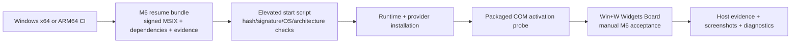

# M6 Windows Real-Host Runbook

This runbook resumes OpenWidgetKit validation at the first point that requires a
real Windows Widgets Board. The CI-produced resume bundle already contains a
development-signed provider MSIX, its public trust certificate, the matching
Windows App Runtime 2.3.1 packages, the native Visual C++ Redistributable, host
scripts, and machine-verifiable provenance.

The bundle is for development validation only. Its signing certificate is
self-signed, contains no exported private key, expires after 180 days, and must
not be used to distribute a production package.



## 1. Select the host and artifact

Use a physical or virtual Windows 11 client with the Windows Web Experience Pack
and Widgets Board enabled. Windows Server runners do not satisfy M6 because they
do not host the real Widgets Board.

Match the artifact to the machine's native architecture:

| Native host | GitHub Actions artifact |
|---|---|
| x64 | `m6-windows-resume-x64` |
| ARM64 | `m6-windows-resume-arm64` |

Download the artifact from the latest successful **M5 Windows Provider Build**
workflow on `main`, then extract it to a dedicated directory such as
`C:\OpenWidgetKit-M6`. Do not mix files from different workflow runs or
architectures; the startup script rejects hash and provenance mismatches.

GitHub Actions artifacts and the development certificate are intentionally
time-bounded. If the latest artifact is unavailable or its certificate has
expired, regenerate both architectures from the current `main` branch:

```powershell
gh workflow run m5-windows.yml --ref main
gh run list --workflow m5-windows.yml --branch main --limit 1
```

Open the reported run, wait for both architecture jobs to pass, and download
the newly generated artifact. Do not reuse an expired certificate or re-sign an
old MSIX outside the workflow; a fresh run reproduces the complete package,
dependencies, signing identity, hashes, and provenance together.

## 2. Validate without changing the machine

Open Windows PowerShell in the extracted directory and run:

```powershell
Set-ExecutionPolicy -Scope Process Bypass
.\start-m6-windows.ps1 -ValidateArtifactOnly
```

This verifies the development MSIX, certificate, host scripts, Windows App
Runtime packages, Visual C++ Redistributable, package identity, architecture,
and every recorded SHA-256. It writes `m6-windows-host-evidence.json` without
installing anything.

## 3. Install and prove packaged COM activation

Open **Windows PowerShell as Administrator** in the same directory and run:

```powershell
Set-ExecutionPolicy -Scope Process Bypass
.\start-m6-windows.ps1
```

The script performs these operations in order:

1. repeats the complete artifact validation;
2. requires Windows 11 client build 22000 or newer, Widgets Board, and an exact
   native architecture match;
3. installs or repairs the native Visual C++ runtime;
4. installs only missing or older Windows App Runtime 2.3.1 packages;
5. trusts the development certificate in `LocalMachine\TrustedPeople`;
6. installs the provider for the current user;
7. activates the registered packaged COM class in a bounded child process; and
8. writes `m6-windows-host-evidence.json` with success or typed failure details.

If the provider package is already installed, the script stops rather than
silently replacing it. To intentionally replace the current-user package with
the downloaded artifact, rerun:

```powershell
.\start-m6-windows.ps1 -ReplaceExisting
```

A successful script result proves installation and direct packaged COM
activation. It deliberately records Widgets Board verification as
`readyForManualVerification`; it does not claim the remaining M6 behavior.

## 4. Execute the real Widgets Board matrix

Open the board with **Win+W**, select **Add widgets**, locate the OpenWidgetKit
fixture, and pin it. Record the following checks against one installed package
and one `m6-windows-host-evidence.json`:

| Area | Required observation |
|---|---|
| Discovery | Fixture appears in the gallery and pins successfully |
| Lifecycle | `CreateWidget`, `Activate`, and `Deactivate` reach the provider |
| Families | small, medium, and large render with the expected family-specific content |
| Themes | light and dark render without stale values or missing resources |
| Timeline | entry progression works for `.atEnd`, `.after`, and `.never` |
| Reload | `WidgetCenter` kind and global reload requests cause a new generation |
| Races | context change and delete during provider work reject stale completion |
| Failure | malformed payload remains observable as failure, never default success |
| Interaction | valid action executes once; unknown, duplicate, and stale actions fail |
| Shutdown | deletion/release drains tasks, callbacks, COM objects, and the process |

Keep screenshots named with architecture, package version, family, theme, and
UTC time. Preserve provider diagnostics together with the host evidence. A
single screenshot is not sufficient to close lifecycle, concurrency, failure,
or shutdown acceptance.

## 5. Clean up the development package and certificate

After evidence collection, run the following from an elevated PowerShell:

```powershell
Get-AppxPackage -Name "OpenWidgetKit.WindowsFixture" |
    Remove-AppxPackage

$Evidence = Get-Content -Raw .\m6-windows-resume-evidence.json |
    ConvertFrom-Json
$CertificatePath = "Cert:\LocalMachine\TrustedPeople\$($Evidence.SigningCertificate.Thumbprint)"
if (Test-Path $CertificatePath) {
    Remove-Item -LiteralPath $CertificatePath -Force
}
```

The shared Microsoft runtimes are intentionally left installed because other
applications may use them. The development provider and its trust certificate
are removed explicitly.

## Completion boundary

M6 is complete only when installation, COM activation, and every applicable
Widgets Board row above have real-host evidence. Artifact validation or CI
packaging alone must remain reported as preparation, not runtime acceptance.
