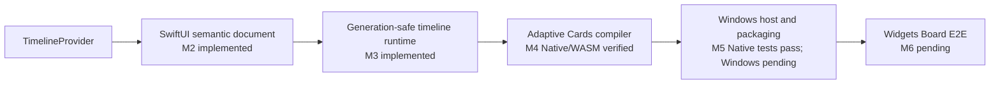
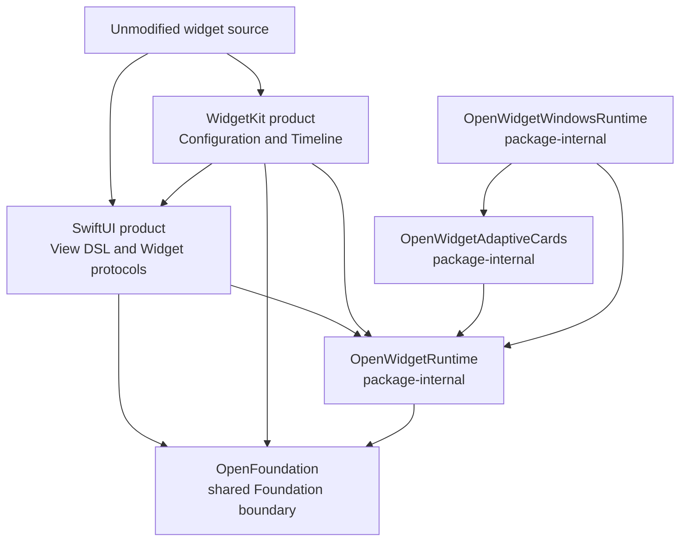

# OpenWidgetKit

OpenWidgetKit is a SwiftPM package for running widget source written for Apple
platforms as a Windows Widgets Provider without changing the application source.

The target usage has the following form:

```swift
import SwiftUI
import WidgetKit

@main
struct WeatherWidget: Widget {
    var body: some WidgetConfiguration {
        StaticConfiguration(
            kind: "weather",
            provider: WeatherProvider()
        ) { entry in
            WeatherView(entry: entry)
        }
    }
}
```

Apple targets use Apple's `SwiftUI.framework` and `WidgetKit.framework`.
Windows targets use the modules named `SwiftUI` and `WidgetKit` provided by
this package. The primary compatibility requirement is that consumers do not
add platform conditionals to their imports or widget definitions.

## Status

M2 through M5 are implemented in source. The package now
contains the widget-scoped SwiftUI view subset, immutable semantic documents,
`Widget` and `StaticConfiguration` lowering, one-shot provider completion
ownership, an immutable registry, generation-safe timeline scheduling, and
`WidgetCenter` control routing. M4 adds deterministic Adaptive Cards 1.6
template/data compilation, light/dark and family conditions, typed unsupported
failures, resource resolution, structural SHA-256 identities, and a bounded
template cache. M5 adds the narrow C ABI, dynamically loaded C++/WinRT
`IWidgetProvider`, COM class factory lifecycle, Swift-owned async entry point,
generation-safe `WidgetManager` updates, a single provider configuration, and
deterministic MSIX manifest tooling.

The M4 compiler passes 12 focused Native tests and builds for normal WASM with
the pinned Swift 6.4 snapshot and matching SDK. The M5 Swift host and manifest
surface passes 12 focused Native tests, including three consecutive warm runs
of the target after the lifecycle review. These checks do not compile or execute
the C++/WinRT provider. The previously verified Windows M1 baseline therefore
does not prove the new provider, x64/ARM64 link, unsigned MSIX, or Widgets Board
behavior. The checked-in `M5 Windows Provider Build` workflow is the target
build gate; M6 remains the signed install and real Widgets Board acceptance
milestone.

The latest lifecycle review corrected or clarified inactive-state suppression,
retained-content-aware recovery, monotonic
delete/recreate generations, complete-template reset for a new instance
lifetime, retryable shutdown completion state, accepted-invalidation and
fail-closed-removal host fences, recovery-before-COM-activation ordering, a
documented `no_module_lock` class-factory boundary, a reentrancy-safe C++ delete
fence, a zero-allocation shutdown callback, typed C ABI status preservation, a valid
packaged-COM ignorable namespace, and bounded transactional `ForEach` identity
retention. Resource paths are now the single source for derived `ms-appx:///`
URIs. The bounded LRU cache now derives an exact semantic structure key before
template compilation. Each cache entry retains the binding plan emitted by that
same compilation, so cache hits reevaluate dynamic data and resource ownership
without rebuilding the template tree or JSON and without independently
reconstructing binding order. The accompanying regression tests pass as part of
the 74-test Native suite.

Package structure or import availability must not be treated as evidence of
implementation completion. See
[IMPLEMENTATION_PROGRESS.md](IMPLEMENTATION_PROGRESS.md) for the current state
and completion criteria.



## Documents

| Document | Responsibility |
|---|---|
| [REQUIREMENTS.md](REQUIREMENTS.md) | Functional requirements, quality requirements, and acceptance criteria |
| [SPECIFICATION.md](SPECIFICATION.md) | Normative module, runtime, IR, timeline, and host integration specification |
| [DESIGN.md](DESIGN.md) | Responsibility boundaries, design decisions, alternatives, and position within the CoreFoundation workspace |
| [WINDOWS_NOTES.md](WINDOWS_NOTES.md) | Windows-specific constraints for COM, MSIX, Adaptive Cards, callback lifetime, and related APIs |
| [API_COMPATIBILITY.md](API_COMPATIBILITY.md) | Pinned Apple API inventory, M2/M3 compatibility surface, fixtures, and Windows M1 compile baseline |
| [Verification/M1_WINDOWS_EVIDENCE.json](Verification/M1_WINDOWS_EVIDENCE.json) | Normalized pinned Windows toolchain, behavior, module, and runtime evidence for M1 |
| [IMPLEMENTATION_PROGRESS.md](IMPLEMENTATION_PROGRESS.md) | Ledger of unimplemented APIs, milestones, and verification evidence |

## Package boundary



The two public products are `SwiftUI` and `WidgetKit`. The package name and
public module names intentionally differ. `OpenWidgetRuntime` shares internal
contracts between the two modules and is not exposed as a public product.

## Intended integration

The package products should be enabled only for Windows targets. Windows and
Web are selected as platforms, not as Package Traits.

```swift
.target(
    name: "WeatherWidget",
    dependencies: [
        .product(
            name: "SwiftUI",
            package: "OpenWidgetKit",
            condition: .when(platforms: [.windows])
        ),
        .product(
            name: "WidgetKit",
            package: "OpenWidgetKit",
            condition: .when(platforms: [.windows])
        )
    ]
)
```

Apple targets do not depend on these package products and resolve the system
frameworks instead. A future WebAssembly backend must likewise be selected by
`.wasi` and an actual JavaScript host capability. Platform identity must not be
represented through traits named `Windows` or `Web`.

## Foundation policy

OpenWidgetKit uses `OpenFoundation` as the shared boundary for
Foundation-compatible APIs. On Windows, OpenFoundation re-exports the
Foundation module supplied by the Swift toolchain, preserving the official
Foundation type identities and implementations. The package does not add
`swift-foundation` as a separate SwiftPM dependency. The compiler, `Foundation`,
`FoundationEssentials`, `FoundationInternationalization`, and runtime libraries
must come from the same pinned toolchain.

`Date`, `CGFloat`, `CGPoint`, `CGSize`, and `CGRect` use the types supplied by
Foundation and are not redeclared in OpenWidgetKit. OpenCoreGraphics also uses
the non-Embedded Foundation geometry types through OpenFoundation, so Windows
consumers share the same type identities.

On Embedded Swift, OpenFoundation does not import or link the Foundation module
and instead supplies only its minimum portable value subset. This is not a
substitution with `FoundationEssentials`. The `SwiftUI`, `WidgetKit`, and
`OpenWidgetRuntime` targets do not select `Foundation` or
`FoundationEssentials` directly.

OpenFoundation owns CFCG value identity. Windows uses the declarations from
toolchain Foundation, while Embedded uses portable declarations from the same
OpenFoundation module. OpenWidgetKit does not depend on OpenCoreGraphics or a
renderer merely to access value types. Only a future backend that selects
rasterization should depend on OpenCoreGraphics.

## Scope

The first static production milestone includes:

- `StaticConfiguration`;
- `TimelineEntry`, `TimelineProvider`, `Timeline`, and `TimelineReloadPolicy`;
- `WidgetFamily` and `TimelineProviderContext`;
- timeline reload through `WidgetCenter`;
- the limited SwiftUI View DSL required by widgets;
- Adaptive Cards template and data generation for Windows Widgets;
- registration, updates, activation/deactivation, and shutdown as a packaged
  Win32 Provider.

The first milestone does not include:

- a complete general-purpose SwiftUI implementation;
- UIKit, AppKit, `UIResponder`, or `NSResponder`;
- Live Activities, Control Widgets, or watch complications;
- complete visual parity for every SwiftUI view and modifier;
- frame animation through OpenCoreAnimation;
- a Web Widget backend that requires remote HTML.

Interactive views, `Action.Execute` compilation, and action routing are the M7
production milestone. Until that surface exists, an unexpected host action is
reported as an explicit typed unsupported failure and is never treated as a
successful no-op.

## Authoritative references

The Apple-side responsibility boundaries are based on the following documents,
reviewed with `remark` on 2026-08-19, and on the Swift interfaces from the
installed macOS 27.0 SDK:

- [SwiftUI Widget](https://developer.apple.com/documentation/swiftui/widget)
- [WidgetKit StaticConfiguration](https://developer.apple.com/documentation/widgetkit/staticconfiguration)
- [WidgetKit TimelineProvider](https://developer.apple.com/documentation/widgetkit/timelineprovider)
- [Creating a widget extension](https://developer.apple.com/documentation/widgetkit/creating-a-widget-extension)

The Windows side follows Microsoft's current Widget Provider contracts:

- [Widget providers](https://learn.microsoft.com/en-us/windows/apps/develop/widgets/widget-providers)
- [Implement a widget provider in a Win32 app](https://learn.microsoft.com/en-us/windows/apps/develop/widgets/implement-widget-provider-win32)
- [Create a widget template](https://learn.microsoft.com/en-us/windows/apps/develop/widgets/widgets-create-a-template)
- [Widget provider manifest](https://learn.microsoft.com/en-us/windows/apps/develop/widgets/widget-provider-manifest)

The distribution and module boundaries of Swift Foundation follow these
official Swift references:

- [swift-foundation](https://github.com/swiftlang/swift-foundation)
- [Foundation distributions](https://github.com/swiftlang/swift-foundation/blob/main/Distributions.md)
- [Swift 6 Foundation](https://www.swift.org/blog/announcing-swift-6/)

The M5 source pins Windows App SDK 2.3.1, Widgets package 2.0.5, C++/WinRT
2.0.230706.1, Visual C++ v145, Windows SDK 10.0.26100.0, and the currently
verified Windows Swift 6.4 development snapshot from 2026-08-14. The packaging
gate verifies exact NuGet hashes and discovers Swift/Foundation DLLs from the
final executable and that same toolchain; it rejects mixed copies rather than
using an unrelated fixed DLL directory.

## Windows provider build gate

`scripts/build-m5-windows.ps1` builds an unsigned x64 or ARM64 provider package.
It validates the toolchain, NuGet graph, package configuration, runtime DLL
origins, generated manifest, and MSIX contents. The workflow runs this script on
the explicit `windows-2025-vs2026` image for both architectures. Signing,
installation, gallery discovery, pinning, and visual behavior belong to M6 and
are intentionally not reported by this build gate.
