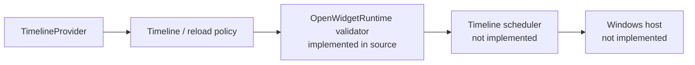
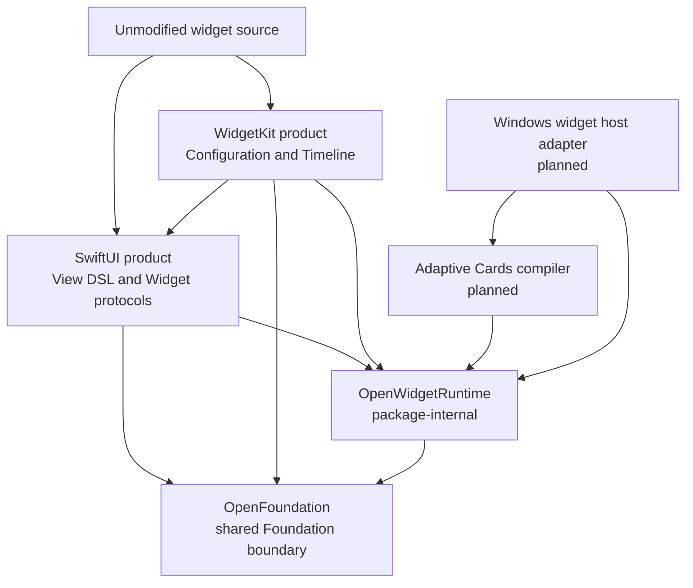

# OpenWidgetKit

OpenWidgetKitは、Appleプラットフォーム向けに書かれたWidgetのソースを変更せず、
Windows上でWindows Widgets Providerとして実行するためのSwiftPMパッケージです。

目標となる利用コードは次の形です。

```swift
import SwiftUI
import WidgetKit

@main
struct WeatherWidget: Widget {
    var body: some WidgetConfiguration {
        StaticConfiguration(
            kind: "weather",
            provider: WeatherProvider()
        ) { entry in
            WeatherView(entry: entry)
        }
    }
}
```

AppleではAppleの`SwiftUI.framework`と`WidgetKit.framework`を使用し、Windowsでは
このパッケージが同名の`SwiftUI`、`WidgetKit`モジュールを提供します。利用側の
importやWidget定義にplatform条件を追加しないことが最上位の互換性要件です。

## Status

現在は**基礎runtime実装段階**です。初期iOS 14/macOS 11相当のtimeline値/provider surface
（entry relevanceを含む）、
`TimelineProviderContext`の基礎、host非依存のtimeline validationをsourceとして実装しました。
Windows Provider、provider completion ownership、scheduler、SwiftUI View DSL、Adaptive Cards変換は
まだ実装していません。各source targetの`FIXME(INCOMPLETE_IMPLEMENTATION)`が残る範囲を明示します。

構造やimportが存在することを実装完了の根拠にしてはいけません。実装状況と完了条件は
[IMPLEMENTATION_PROGRESS.md](IMPLEMENTATION_PROGRESS.md)を参照してください。



## Documents

| 文書 | 責務 |
|---|---|
| [REQUIREMENTS.md](REQUIREMENTS.md) | 実装が満たすべき機能要件・品質要件・受入条件 |
| [SPECIFICATION.md](SPECIFICATION.md) | module、runtime、IR、timeline、host連携の規範仕様 |
| [DESIGN.md](DESIGN.md) | 責務境界、設計判断、代替案、CoreFoundation内の位置付け |
| [WINDOWS_NOTES.md](WINDOWS_NOTES.md) | COM、MSIX、Adaptive Cards、callback lifetimeなどWindows固有の注意点 |
| [IMPLEMENTATION_PROGRESS.md](IMPLEMENTATION_PROGRESS.md) | 未実装API、milestone、検証証拠の台帳 |

## Package boundary



公開productは`SwiftUI`と`WidgetKit`の二つです。package名と公開module名は意図的に
異なります。`OpenWidgetRuntime`は両moduleの内部契約を共有するためのtargetであり、
公開productにはしません。

## Intended integration

依存productはWindows targetでだけ有効にします。WindowsとWebはPackage Traitではなく
platformとして選択します。

```swift
.target(
    name: "WeatherWidget",
    dependencies: [
        .product(
            name: "SwiftUI",
            package: "OpenWidgetKit",
            condition: .when(platforms: [.windows])
        ),
        .product(
            name: "WidgetKit",
            package: "OpenWidgetKit",
            condition: .when(platforms: [.windows])
        )
    ]
)
```

Apple targetはこのpackage productへ依存せず、system frameworkを解決します。WebAssembly
backendを将来追加する場合も`.wasi`と実在するJavaScript host capabilityで選択し、
`Windows`や`Web`というtraitでplatform identityを表現しません。

## Foundation policy

OpenWidgetKitは`OpenFoundation`をFoundation取り扱いの共通境界として使用します。Windowsでは
OpenFoundationがSwift toolchain組み込み`Foundation`を再公開するため、公式Foundationの型identityと
実装をそのまま使用します。`swift-foundation`をSwiftPM dependencyとして追加せず、compiler、
`Foundation`、`FoundationEssentials`、`FoundationInternationalization`、runtime libraryを同一の
固定toolchainから取得します。

`Date`、`CGFloat`、`CGPoint`、`CGSize`、`CGRect`はFoundationが提供する型をそのまま使用し、
OpenWidgetKit内では再定義しません。既存OpenCoreGraphicsも非Embedded targetではFoundationの
geometry型をOpenFoundation経由で使用するため、Windows上では同じ型identityを共有します。

Embedded SwiftではOpenFoundationがFoundation moduleをimport/linkせず、必要最小限のportable値だけを
提供します。`FoundationEssentials`へ差し替える設計ではありません。`SwiftUI`、`WidgetKit`、
`OpenWidgetRuntime`は`Foundation`または`FoundationEssentials`を直接選択しません。

OpenFoundationはCFCG値identityを所有します。Windowsではtoolchain Foundationの宣言を使用し、
Embeddedでは同じmoduleがportable宣言を提供します。OpenWidgetKitは値型のためにOpenCoreGraphicsや
rendererを依存へ追加しません。将来rasterizationを選ぶbackendだけがOpenCoreGraphicsへ依存します。

## Scope

最初のproduction milestoneは次の範囲です。

- `StaticConfiguration`;
- `TimelineEntry`、`TimelineProvider`、`Timeline`、`TimelineReloadPolicy`;
- `WidgetFamily`と`TimelineProviderContext`;
- `WidgetCenter`のtimeline reload;
- Widgetに必要な限定的なSwiftUI View DSL;
- Windows Widgets用Adaptive Cards template/data生成;
- packaged Win32 Providerとしての登録、更新、action、停止。

次の項目は最初のmilestoneに含みません。

- 一般アプリケーション向けの完全なSwiftUI実装;
- UIKit、AppKit、`UIResponder`、`NSResponder`;
- Live Activities、Control Widgets、watch complication;
- 全SwiftUI view/modifierの見た目の完全一致;
- OpenCoreAnimationを用いたframe animation;
- remote HTMLを必須とするWeb Widget backend。

## Authoritative references

Apple側の責務境界は、2026-08-19に`remark`で確認した以下の文書と、インストール済み
MacOSX 27.0 SDKのSwift interfaceを基準にしています。

- [SwiftUI Widget](https://developer.apple.com/documentation/swiftui/widget)
- [WidgetKit StaticConfiguration](https://developer.apple.com/documentation/widgetkit/staticconfiguration)
- [WidgetKit TimelineProvider](https://developer.apple.com/documentation/widgetkit/timelineprovider)
- [Creating a widget extension](https://developer.apple.com/documentation/widgetkit/creating-a-widget-extension)

Windows側はMicrosoftの現行Widget Provider契約を基準にします。

- [Widget providers](https://learn.microsoft.com/en-us/windows/apps/develop/widgets/widget-providers)
- [Implement a widget provider in a Win32 app](https://learn.microsoft.com/en-us/windows/apps/develop/widgets/implement-widget-provider-win32)
- [Create a widget template](https://learn.microsoft.com/en-us/windows/apps/develop/widgets/widgets-create-a-template)
- [Widget provider manifest](https://learn.microsoft.com/en-us/windows/apps/develop/widgets/widget-provider-manifest)

Swift Foundationの配布・module境界はSwift公式の次の文書を基準にします。

- [swift-foundation](https://github.com/swiftlang/swift-foundation)
- [Foundation distributions](https://github.com/swiftlang/swift-foundation/blob/main/Distributions.md)
- [Swift 6 Foundation](https://www.swift.org/blog/announcing-swift-6/)

実装開始時にはWindows App SDK、Swift toolchain、Windows SDKの正確なbaselineを固定し、
文書の日付ではなくそのversionのheader、metadata、runtime behaviorを確認します。
