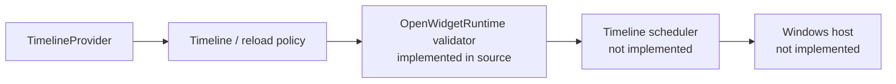
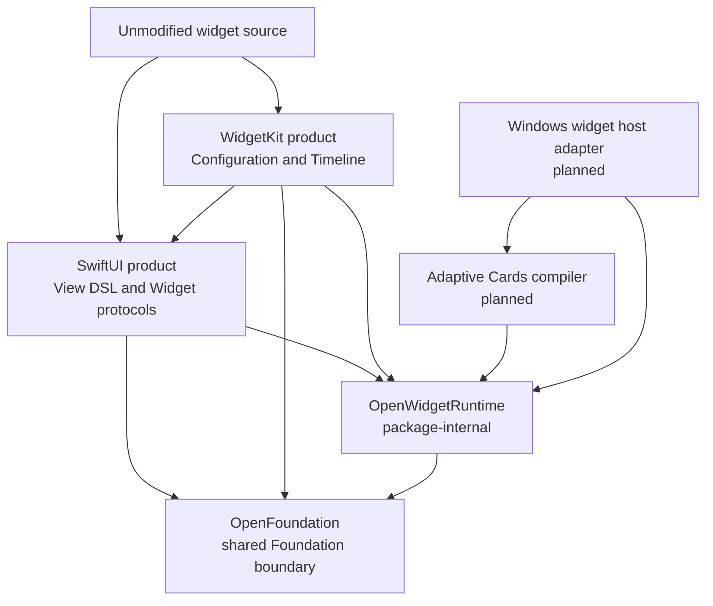

# OpenWidgetKit

OpenWidgetKit is a SwiftPM package for running widget source written for Apple
platforms as a Windows Widgets Provider without changing the application source.

The target usage has the following form:

```swift
import SwiftUI
import WidgetKit

@main
struct WeatherWidget: Widget {
    var body: some WidgetConfiguration {
        StaticConfiguration(
            kind: "weather",
            provider: WeatherProvider()
        ) { entry in
            WeatherView(entry: entry)
        }
    }
}
```

Apple targets use Apple's `SwiftUI.framework` and `WidgetKit.framework`.
Windows targets use the modules named `SwiftUI` and `WidgetKit` provided by
this package. The primary compatibility requirement is that consumers do not
add platform conditionals to their imports or widget definitions.

## Status

The package is currently at the foundational runtime stage. It implements the
initial iOS 14 and macOS 11 timeline value and provider surface, including entry
relevance, the basic `TimelineProviderContext`, and host-independent timeline
validation. The Windows Provider, provider completion ownership, scheduler,
SwiftUI View DSL, and Adaptive Cards conversion are not implemented. Each source
target uses `FIXME(INCOMPLETE_IMPLEMENTATION)` to identify its incomplete surface.
The M1 API inventory and compatibility-fixture milestone is complete across the
pinned Apple SDKs, normal WASM, and pinned x86_64 Windows toolchain.

Package structure or import availability must not be treated as evidence of
implementation completion. See
[IMPLEMENTATION_PROGRESS.md](IMPLEMENTATION_PROGRESS.md) for the current state
and completion criteria.



## Documents

| Document | Responsibility |
|---|---|
| [REQUIREMENTS.md](REQUIREMENTS.md) | Functional requirements, quality requirements, and acceptance criteria |
| [SPECIFICATION.md](SPECIFICATION.md) | Normative module, runtime, IR, timeline, and host integration specification |
| [DESIGN.md](DESIGN.md) | Responsibility boundaries, design decisions, alternatives, and position within the CoreFoundation workspace |
| [WINDOWS_NOTES.md](WINDOWS_NOTES.md) | Windows-specific constraints for COM, MSIX, Adaptive Cards, callback lifetime, and related APIs |
| [API_COMPATIBILITY.md](API_COMPATIBILITY.md) | Pinned M1 Apple API inventory, compatibility differences, fixtures, and Windows compile baseline |
| [Verification/M1_WINDOWS_EVIDENCE.json](Verification/M1_WINDOWS_EVIDENCE.json) | Normalized pinned Windows toolchain, behavior, module, and runtime evidence for M1 |
| [IMPLEMENTATION_PROGRESS.md](IMPLEMENTATION_PROGRESS.md) | Ledger of unimplemented APIs, milestones, and verification evidence |

## Package boundary



The two public products are `SwiftUI` and `WidgetKit`. The package name and
public module names intentionally differ. `OpenWidgetRuntime` shares internal
contracts between the two modules and is not exposed as a public product.

## Intended integration

The package products should be enabled only for Windows targets. Windows and
Web are selected as platforms, not as Package Traits.

```swift
.target(
    name: "WeatherWidget",
    dependencies: [
        .product(
            name: "SwiftUI",
            package: "OpenWidgetKit",
            condition: .when(platforms: [.windows])
        ),
        .product(
            name: "WidgetKit",
            package: "OpenWidgetKit",
            condition: .when(platforms: [.windows])
        )
    ]
)
```

Apple targets do not depend on these package products and resolve the system
frameworks instead. A future WebAssembly backend must likewise be selected by
`.wasi` and an actual JavaScript host capability. Platform identity must not be
represented through traits named `Windows` or `Web`.

## Foundation policy

OpenWidgetKit uses `OpenFoundation` as the shared boundary for
Foundation-compatible APIs. On Windows, OpenFoundation re-exports the
Foundation module supplied by the Swift toolchain, preserving the official
Foundation type identities and implementations. The package does not add
`swift-foundation` as a separate SwiftPM dependency. The compiler, `Foundation`,
`FoundationEssentials`, `FoundationInternationalization`, and runtime libraries
must come from the same pinned toolchain.

`Date`, `CGFloat`, `CGPoint`, `CGSize`, and `CGRect` use the types supplied by
Foundation and are not redeclared in OpenWidgetKit. OpenCoreGraphics also uses
the non-Embedded Foundation geometry types through OpenFoundation, so Windows
consumers share the same type identities.

On Embedded Swift, OpenFoundation does not import or link the Foundation module
and instead supplies only its minimum portable value subset. This is not a
substitution with `FoundationEssentials`. The `SwiftUI`, `WidgetKit`, and
`OpenWidgetRuntime` targets do not select `Foundation` or
`FoundationEssentials` directly.

OpenFoundation owns CFCG value identity. Windows uses the declarations from
toolchain Foundation, while Embedded uses portable declarations from the same
OpenFoundation module. OpenWidgetKit does not depend on OpenCoreGraphics or a
renderer merely to access value types. Only a future backend that selects
rasterization should depend on OpenCoreGraphics.

## Scope

The first production milestone includes:

- `StaticConfiguration`;
- `TimelineEntry`, `TimelineProvider`, `Timeline`, and `TimelineReloadPolicy`;
- `WidgetFamily` and `TimelineProviderContext`;
- timeline reload through `WidgetCenter`;
- the limited SwiftUI View DSL required by widgets;
- Adaptive Cards template and data generation for Windows Widgets;
- registration, updates, actions, and shutdown as a packaged Win32 Provider.

The first milestone does not include:

- a complete general-purpose SwiftUI implementation;
- UIKit, AppKit, `UIResponder`, or `NSResponder`;
- Live Activities, Control Widgets, or watch complications;
- complete visual parity for every SwiftUI view and modifier;
- frame animation through OpenCoreAnimation;
- a Web Widget backend that requires remote HTML.

## Authoritative references

The Apple-side responsibility boundaries are based on the following documents,
reviewed with `remark` on 2026-08-19, and on the Swift interfaces from the
installed macOS 27.0 SDK:

- [SwiftUI Widget](https://developer.apple.com/documentation/swiftui/widget)
- [WidgetKit StaticConfiguration](https://developer.apple.com/documentation/widgetkit/staticconfiguration)
- [WidgetKit TimelineProvider](https://developer.apple.com/documentation/widgetkit/timelineprovider)
- [Creating a widget extension](https://developer.apple.com/documentation/widgetkit/creating-a-widget-extension)

The Windows side follows Microsoft's current Widget Provider contracts:

- [Widget providers](https://learn.microsoft.com/en-us/windows/apps/develop/widgets/widget-providers)
- [Implement a widget provider in a Win32 app](https://learn.microsoft.com/en-us/windows/apps/develop/widgets/implement-widget-provider-win32)
- [Create a widget template](https://learn.microsoft.com/en-us/windows/apps/develop/widgets/widgets-create-a-template)
- [Widget provider manifest](https://learn.microsoft.com/en-us/windows/apps/develop/widgets/widget-provider-manifest)

The distribution and module boundaries of Swift Foundation follow these
official Swift references:

- [swift-foundation](https://github.com/swiftlang/swift-foundation)
- [Foundation distributions](https://github.com/swiftlang/swift-foundation/blob/main/Distributions.md)
- [Swift 6 Foundation](https://www.swift.org/blog/announcing-swift-6/)

Before implementation begins, the exact Windows App SDK, Swift toolchain, and
Windows SDK baseline must be pinned. Headers, metadata, and runtime behavior
must be checked against those exact versions rather than inferred from document
publication dates.
