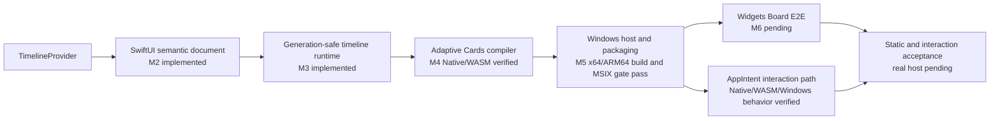
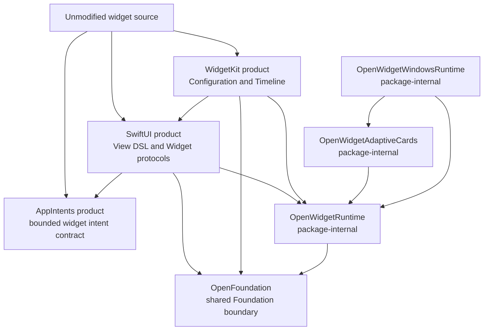

# OpenWidgetKit

OpenWidgetKit is a SwiftPM package for running widget source written for Apple
platforms as a Windows Widgets Provider without changing the application source.

The target usage has the following form:

```swift
import SwiftUI
import WidgetKit

@main
struct WeatherWidget: Widget {
    var body: some WidgetConfiguration {
        StaticConfiguration(
            kind: "weather",
            provider: WeatherProvider()
        ) { entry in
            WeatherView(entry: entry)
        }
    }
}
```

Apple targets use Apple's `SwiftUI.framework` and `WidgetKit.framework`.
Windows targets use the modules named `SwiftUI` and `WidgetKit` provided by
this package. The primary compatibility requirement is that consumers do not
add platform conditionals to their imports or widget definitions.

## Status

M2 through M5 and M7 are implemented in source. The package now
contains the widget-scoped SwiftUI view subset, immutable semantic documents,
`Widget` and `StaticConfiguration` lowering, one-shot provider completion
ownership, an immutable registry, generation-safe timeline scheduling, and
`WidgetCenter` control routing. M4 adds deterministic Adaptive Cards 1.6
template/data compilation, light/dark and family conditions, typed unsupported
failures, resource resolution, structural SHA-256 identities, and a bounded
template cache. M5 adds the narrow C ABI, dynamically loaded C++/WinRT
`IWidgetProvider`, COM class factory lifecycle, Swift-owned async entry point,
generation-safe `WidgetManager` updates, a single provider configuration, and
deterministic MSIX manifest tooling.

The M4 compiler passes 12 focused Native tests and builds for normal WASM with
the pinned Swift 6.4 snapshot and matching SDK. The M5 Swift host and manifest
surface passes 13 focused Native tests, including three consecutive warm runs
of the target after the lifecycle review. The Windows M1 gate verifies the
shared API, behavior, OpenFoundation identity, and dynamic Foundation runtime
on x64. The M5 gate compiles the package test graph, Swift provider executable,
and C++/WinRT bridge natively on both x64 and ARM64, then verifies the official
architecture-matched Swift runtime closure and expanded unsigned MSIX. It does
not activate COM or execute the provider in Widgets Board. The same workflow
also produces an architecture-specific M6 resume bundle containing a
development-signed copy, public trust certificate, Windows App Runtime 2.3.1,
the native Visual C++ Redistributable, host scripts, and hash evidence. Signed
installation, COM activation on a client host, and real Widgets Board acceptance
remain M6.

The current P0/P1 hardening makes the Windows workflow run on pushes and pull
requests, lets SwiftPM launch its generated test products with a ten-minute
timeout, and exercises the standalone remote OpenFoundation dependency graph.
All 97 package tests pass on both x64 and ARM64 Windows in addition to Native.
Runtime diagnostics use bounded, typed correlation records rather than
arbitrary `Error` strings. Windows callback ingress uses a fixed-capacity ring
buffer; overflow closes ingress, preserves a terminal shutdown event, and
requests native shutdown.

M7 interaction is now implemented in source through the Apple-compatible
`AppIntent`-backed `Button` entry point. The semantic document retains stable
action identities and concrete intent handlers, the Adaptive Cards compiler
emits variant-specific `Action.Execute` bindings, and the Windows host accepts
only the action table committed by `UpdateWidget`. Opaque action state is scoped
to the provider session, widget instance, generation, and entry revision;
externally attempted revisions are never reused after an ambiguous bridge
failure. Light and dark verbs for one logical action share one in-flight fence.
`LocalizedStringResource` metadata remains in the semantic document until the
selected text renderer resolves it. Action validation and reservation remain
ordered with provider events, while intent completion is monitored separately
so a suspended intent cannot block deletion, context changes, or shutdown, or
retain the provider-lifetime bridge after its owner is released. The owned
`OnActionInvoked` callback path executes the intent and requests a new timeline
generation. Focused success, unknown, malformed, duplicate, stale-entry, and
reentrant/session/instance/lifecycle/owner-release tests pass on Native. The
pinned Apple/replacement API fixture passes, and the M7 API plus Adaptive Cards
targets build for normal WASM against the accompanying OpenFoundation localized-
value supplement. The release manifest now pins the published supplement, so
the clean standalone WASM dependency graph exercises the same implementation.
M7 compiles and its host-neutral behavior tests pass on x64 and ARM64 Windows;
real action delivery through Widgets Board remains unverified.

The latest lifecycle review corrected or clarified inactive-state suppression,
retained-content-aware recovery, monotonic
delete/recreate generations, complete-template reset for a new instance
lifetime, retryable shutdown completion state, accepted-invalidation and
fail-closed-removal host fences, recovery-before-COM-activation ordering, a
documented `no_module_lock` class-factory boundary, a reentrancy-safe C++ delete
fence, a zero-allocation shutdown callback, typed C ABI status preservation, a valid
packaged-COM ignorable namespace, and bounded transactional `ForEach` identity
retention. Resource paths are now the single source for derived `ms-appx:///`
URIs. The bounded LRU cache now derives an exact semantic structure key before
template compilation. Each cache entry retains the binding plan emitted by that
same compilation, so cache hits reevaluate dynamic data and resource ownership
without rebuilding the template tree or JSON and without independently
reconstructing binding order. The accompanying regression tests pass as part of
the 97-test Native suite.

Package structure or import availability must not be treated as evidence of
implementation completion. See
[IMPLEMENTATION_PROGRESS.md](IMPLEMENTATION_PROGRESS.md) for the current state
and completion criteria.



## Documents

| Document | Responsibility |
|---|---|
| [REQUIREMENTS.md](REQUIREMENTS.md) | Functional requirements, quality requirements, and acceptance criteria |
| [SPECIFICATION.md](SPECIFICATION.md) | Normative module, runtime, IR, timeline, and host integration specification |
| [DESIGN.md](DESIGN.md) | Responsibility boundaries, design decisions, alternatives, and position within the CoreFoundation workspace |
| [WINDOWS_NOTES.md](WINDOWS_NOTES.md) | Windows-specific constraints for COM, MSIX, Adaptive Cards, callback lifetime, and related APIs |
| [API_COMPATIBILITY.md](API_COMPATIBILITY.md) | Pinned Apple API inventory, M2/M3 compatibility surface, fixtures, and Windows M1 compile baseline |
| [Verification/M1_WINDOWS_EVIDENCE.json](Verification/M1_WINDOWS_EVIDENCE.json) | Normalized pinned Windows toolchain, behavior, module, and runtime evidence for M1 |
| [Verification/M5_WINDOWS_EVIDENCE.json](Verification/M5_WINDOWS_EVIDENCE.json) | Normalized x64/ARM64 Swift, C++/WinRT, runtime-closure, and MSIX build evidence for M5 |
| [M6_WINDOWS_RUNBOOK.md](M6_WINDOWS_RUNBOOK.md) | One-command artifact validation, installation, packaged COM probe, Widgets Board matrix, and cleanup for the first real Windows host |
| [IMPLEMENTATION_PROGRESS.md](IMPLEMENTATION_PROGRESS.md) | Ledger of unimplemented APIs, milestones, and verification evidence |

## Package boundary



The three public products are `AppIntents`, `SwiftUI`, and `WidgetKit`. The package name and
public module names intentionally differ. `OpenWidgetRuntime` shares internal
contracts between the public modules and is not exposed as a public product.

The release manifest resolves `OpenFoundation` from its pinned repository
revision, so cloning OpenWidgetKit does not require a sibling workspace layout.
Workspace contributors can opt into the local checkout without changing the
manifest:

```bash
swift package edit OpenFoundation --path ../OpenFoundation
```

Use `swift package unedit OpenFoundation` before validating the published
dependency graph.

## Intended integration

The package products should be enabled only for Windows targets. Windows and
Web are selected as platforms, not as Package Traits.

```swift
.target(
    name: "WeatherWidget",
    dependencies: [
        .product(
            name: "AppIntents",
            package: "OpenWidgetKit",
            condition: .when(platforms: [.windows])
        ),
        .product(
            name: "SwiftUI",
            package: "OpenWidgetKit",
            condition: .when(platforms: [.windows])
        ),
        .product(
            name: "WidgetKit",
            package: "OpenWidgetKit",
            condition: .when(platforms: [.windows])
        )
    ]
)
```

Apple targets do not depend on these package products and resolve the system
frameworks instead. A future WebAssembly backend must likewise be selected by
`.wasi` and an actual JavaScript host capability. Platform identity must not be
represented through traits named `Windows` or `Web`.

## Foundation policy

OpenWidgetKit uses `OpenFoundation` as the shared boundary for
Foundation-compatible APIs. On Windows, OpenFoundation re-exports the
Foundation module supplied by the Swift toolchain, preserving the official
Foundation type identities and implementations. The package does not add
`swift-foundation` as a separate SwiftPM dependency. The compiler, `Foundation`,
`FoundationEssentials`, `FoundationInternationalization`, and runtime libraries
must come from the same pinned toolchain.

`Date`, `CGFloat`, `CGPoint`, `CGSize`, and `CGRect` use the types supplied by
Foundation and are not redeclared in OpenWidgetKit. OpenCoreGraphics also uses
the non-Embedded Foundation geometry types through OpenFoundation, so Windows
consumers share the same type identities.

On Embedded Swift, OpenFoundation does not import or link the Foundation module
and instead supplies only its minimum portable value subset. This is not a
substitution with `FoundationEssentials`. The `SwiftUI`, `WidgetKit`, and
`OpenWidgetRuntime` targets do not select `Foundation` or
`FoundationEssentials` directly.

OpenFoundation owns CFCG value identity. Windows uses the declarations from
toolchain Foundation, while Embedded uses portable declarations from the same
OpenFoundation module. OpenWidgetKit does not depend on OpenCoreGraphics or a
renderer merely to access value types. Only a future backend that selects
rasterization should depend on OpenCoreGraphics.

## Scope

The first static production milestone includes:

- `StaticConfiguration`;
- `TimelineEntry`, `TimelineProvider`, `Timeline`, and `TimelineReloadPolicy`;
- `WidgetFamily` and `TimelineProviderContext`;
- timeline reload through `WidgetCenter`;
- the limited SwiftUI View DSL required by widgets;
- Adaptive Cards template and data generation for Windows Widgets;
- registration, updates, activation/deactivation, and shutdown as a packaged
  Win32 Provider.

The first milestone does not include:

- a complete general-purpose SwiftUI implementation;
- UIKit, AppKit, `UIResponder`, or `NSResponder`;
- Live Activities, Control Widgets, or watch complications;
- complete visual parity for every SwiftUI view and modifier;
- frame animation through OpenCoreAnimation;
- a Web Widget backend that requires remote HTML.

The bounded M7 source surface supports `Button(intent:label:)` and its text and
role overloads. The label must currently lower to `Text`; arbitrary labels,
`Toggle`, App Intent parameter property wrappers, foreground/open-app execution,
the cancel role, styled action titles, and other App Intents capabilities remain
undeclared or fail with a typed semantic/compiler error. Source implementation
does not establish production acceptance:
signed installation, real `Action.Execute` delivery, and Widgets Board
reentrancy behavior still require M6/M7 host verification.

## Authoritative references

The Apple-side responsibility boundaries are based on the following documents,
reviewed with `remark` on 2026-08-19, and on the Swift interfaces from the
installed macOS 27.0 SDK:

- [SwiftUI Widget](https://developer.apple.com/documentation/swiftui/widget)
- [WidgetKit StaticConfiguration](https://developer.apple.com/documentation/widgetkit/staticconfiguration)
- [WidgetKit TimelineProvider](https://developer.apple.com/documentation/widgetkit/timelineprovider)
- [Creating a widget extension](https://developer.apple.com/documentation/widgetkit/creating-a-widget-extension)
- [Adding interactivity to widgets and Live Activities](https://developer.apple.com/documentation/widgetkit/adding-interactivity-to-widgets-and-live-activities)

The Windows side follows Microsoft's current Widget Provider contracts:

- [Widget providers](https://learn.microsoft.com/en-us/windows/apps/develop/widgets/widget-providers)
- [Implement a widget provider in a Win32 app](https://learn.microsoft.com/en-us/windows/apps/develop/widgets/implement-widget-provider-win32)
- [Create a widget template](https://learn.microsoft.com/en-us/windows/apps/develop/widgets/widgets-create-a-template)
- [Action.Execute](https://learn.microsoft.com/en-us/adaptive-cards/schema-explorer/action-execute)
- [IWidgetProvider.OnActionInvoked](https://learn.microsoft.com/en-us/windows/windows-app-sdk/api/winrt/microsoft.windows.widgets.providers.iwidgetprovider.onactioninvoked)
- [Widget provider manifest](https://learn.microsoft.com/en-us/windows/apps/develop/widgets/widget-provider-manifest)

The distribution and module boundaries of Swift Foundation follow these
official Swift references:

- [swift-foundation](https://github.com/swiftlang/swift-foundation)
- [Foundation distributions](https://github.com/swiftlang/swift-foundation/blob/main/Distributions.md)
- [Swift 6 Foundation](https://www.swift.org/blog/announcing-swift-6/)

The M5 source pins Windows App SDK 2.3.1, Widgets package 2.0.5, C++/WinRT
2.0.230706.1, WiX Toolset SDK 4.0.5, Visual C++ v145, Windows SDK 10.0.26100.0,
and the currently verified Windows Swift 6.4 development snapshot from
2026-08-14. The packaging gate verifies exact NuGet hashes and obtains each
target architecture's Swift/Foundation payload from the pinned toolchain's
official `rtl.shared.<architecture>.msm` redistributable merge module. In this
name, `shared` describes dynamic Swift linkage. The gate uses the same WiX 4.0.5
toolchain as the Swift installer to export the merge module's embedded cabinet
directly into an application-private runtime. It checks every PE machine and
proves the Swift runtime dependency closure instead of searching across host
and cross-target SDK trees.
WiX 4.0.5 matches the SDK used to produce Swift 6.4's merge modules and avoids
making the build implicitly accept the maintenance-fee EULA introduced in later
WiX releases.

The Swift provider executable owns the packaged application. The C++/WinRT
bridge remains a class library, and the generated manifest declares a
framework-package dependency on `Microsoft.WindowsAppRuntime.2` version
2.3.1.0 or later. The package gate verifies that dependency after expanding the
MSIX. It also extracts the four architecture-matched Microsoft-signed runtime
packages from the already SHA-256-pinned runtime NuGet package and captures the
native Visual C++ Redistributable selected by the active v145 toolset. This
keeps fresh-host deployment dependencies in the same evidence chain as the
provider instead of assuming they already exist on the machine.

## Windows provider build gate

`scripts/build-m5-windows.ps1` is the historical entry point for the generic
x64/ARM64 provider packager. It requires the consumer's provider configuration,
Swift package directory, executable product, and either an asset root or the
explicit fixture-asset switch. It validates the toolchain, NuGet graph, package
configuration, official Swift redistributable and WiX provenance, generated
manifest, and expanded MSIX contents. SwiftPM resource bundles adjacent to the
selected executable are staged with it.

A distributable invocation must supply a PFX, a password environment-variable
name, and a timestamp URL. The script signs and verifies the resulting MSIX.
Unsigned output requires the explicit `-AllowUnsigned` switch and is treated as
a non-distributable fixture. For example:

```powershell
./scripts/build-m5-windows.ps1 `
    -Architecture x64 `
    -ConfigurationPath Provider/OpenWidgetProvider.json `
    -ProviderPackageDirectory . `
    -ProviderProduct WeatherWidgetProvider `
    -AssetRoot Provider `
    -SigningCertificatePath $env:WIDGET_SIGNING_PFX `
    -SigningPasswordEnvironmentVariable WIDGET_SIGNING_PASSWORD `
    -TimestampURL $env:WIDGET_TIMESTAMP_URL
```

The repository workflow runs this script on
`windows-2025-vs2026` with the x64 Swift installer and on
`windows-11-vs2026-arm` with the ARM64 Swift installer. The build script
requires the active Swift host triple and Visual Studio host architecture to
match the package architecture, so this gate never substitutes cross-compiled
output. The repository fixture deliberately selects unsigned output. Signed
production distribution still requires an externally owned certificate and
timestamp policy.

For real-host continuation, the workflow passes the preserved unsigned M5
output to `scripts/prepare-m6-windows.ps1`. That script creates a non-exportable,
180-day development signing key, signs a copy of the MSIX, exports only the
public certificate, removes the private key from the runner, and emits the
`m6-windows-resume-x64` and `m6-windows-resume-arm64` artifacts. Each artifact
contains `start-m6-windows.ps1`, which first verifies every recorded hash and
signature. On an elevated Windows 11 client it then installs missing runtime
dependencies, trusts the development certificate, installs the provider, and
performs a time-bounded packaged COM activation probe. See
[M6_WINDOWS_RUNBOOK.md](M6_WINDOWS_RUNBOOK.md).

Artifact preparation does not count as signed installation or COM activation
on a real client. Gallery discovery, pinning, lifecycle, visual behavior,
interaction, and shutdown remain the M6 real-host gate.
