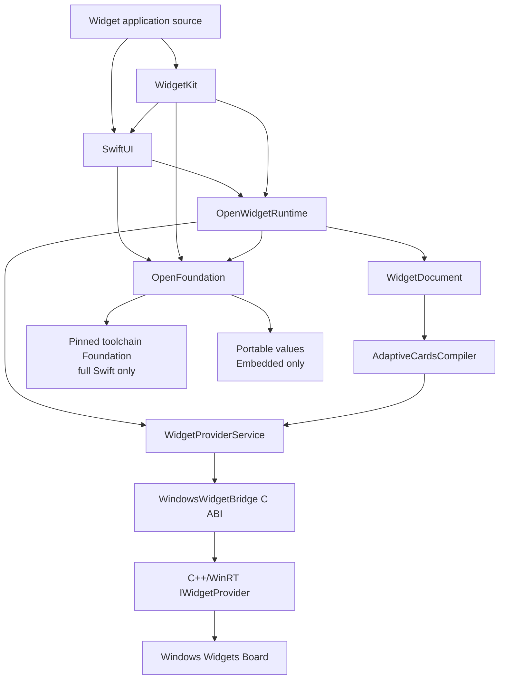
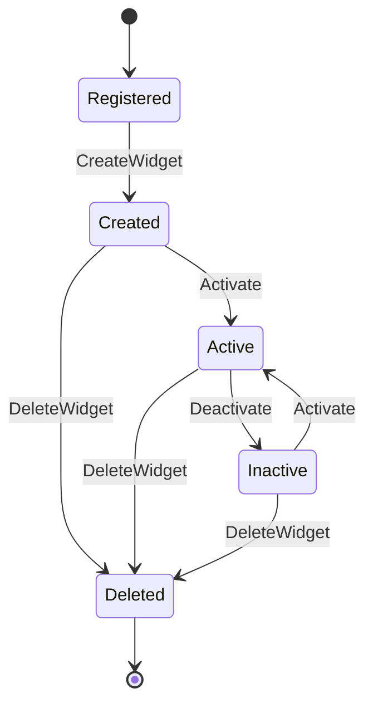
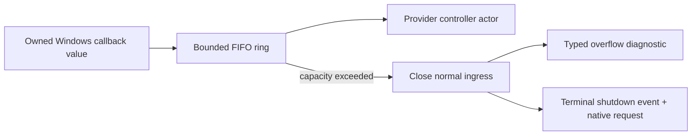

# OpenWidgetKit Specification

## 1. Normative scope

この文書は、公開moduleとWindows runtimeのobservable behaviorを規定します。未実装の型名は
設計上の名前であり、公開宣言が存在することを意味しません。公開APIへの昇格はApple API
baselineとbehavior testが揃った時点で行います。

## 2. Module graph



依存方向は一方向です。host、compiler、WinRT型が公開`SwiftUI` Viewや`WidgetKit`
configurationへ逆流してはいけません。

## 3. Public module ownership

### 3.1 SwiftUI module

`SwiftUI`は次を所有します。

- `View`とresult builder;
- Widgetで対応するprimitive/container View;
- Widgetで対応するmodifierとenvironment;
- `Widget`;
- `WidgetConfiguration`;
- `WidgetBundle`;

Apple SDKで`Widget`、`WidgetConfiguration`、`WidgetBundle`はSwiftUI moduleに所属するため、
この型の所有境界を変えてはいけません。

### 3.2 WidgetKit module

`WidgetKit`は次を所有します。

- `StaticConfiguration`;
- `TimelineEntry`;
- `TimelineProvider`;
- `TimelineProviderContext`;
- `Timeline`;
- `TimelineReloadPolicy`;
- `WidgetFamily`;
- `WidgetCenter`;
- `Widget.main()`と`WidgetBundle.main()`のdefault bootstrap extension;
- configuration modifierのうちWidget lifecycleを変更するもの。

Apple SDKでdefault `main()` extensionはWidgetKit moduleに所属するため、この実装境界を
変えてはいけません。

### 3.3 OpenWidgetRuntime target

`OpenWidgetRuntime`は公開productではありません。次の共有契約を所有します。

- type-erased widget registration;
- type-erased timeline requests;
- Widget bootstrap;
- host-neutral environment;
- semantic document generation boundary;
- lifecycle service interface;
- typed runtime errors;
- shutdown coordination。

公開module間で共有する内部型は`package` accessを使用し、公開互換APIへ混入させません。

### 3.4 Foundation boundary

OpenWidgetKitはOpenFoundationを共通import境界とし、WindowsではSwift toolchainに組み込まれた
`Foundation`を互換値型の正本とします。
targetごとのimport contractは次の通りです。

| Target | Import contract | Reason |
|---|---|---|
| `SwiftUI` | `@_exported import OpenFoundation` | View sourceからFoundation互換値型を利用可能にする |
| `WidgetKit` | `@_exported import OpenFoundation`、`@_exported import SwiftUI` | timelineとcontextの公開signatureを構成する |
| `OpenWidgetRuntime` | `import OpenFoundation` | package-visible runtime contractで同じ値境界を共有する |
| Windows C/C++ bridge | Foundation型をABIへ公開しない | Swift/C++ ABIとowner境界を固定しないため |

`Date`、`CGFloat`、`CGPoint`、`CGSize`、`CGRect`はFoundationの宣言を使用します。
OpenWidgetKitは代替型や条件付きtypealiasを宣言しません。非Embedded OpenCoreGraphicsもFoundationの
geometry型を使用するため、Windows上のView、timeline context、graphics resourceは変換なしで
同じ値を共有します。

EmbeddedではOpenFoundationがportable CFCG値型を宣言します。SwiftUI targetはOpenFoundationを
re-exportし、OpenWidgetKitは同名型を複製しません。geometry operationやrasterizationが必要なbackend
だけがOpenCoreGraphicsへ依存し、値型の公開だけでrenderer依存を引き込みません。

full SwiftではOpenFoundationがFoundation umbrellaを再公開します。EmbeddedではFoundation familyを
linkせずportable subsetを提供します。OpenWidgetKit targetが`FoundationEssentials`を直接選択する
分岐は設けません。

`swift-foundation` repositoryをpackage dependencyとして解決しません。OSまたはtoolchain組み込み版と
package版を同一processへ混在させず、compilerとruntime libraryを同じ固定toolchainから配布します。

## 4. API baseline

2026-08-19時点のMacOSX 27.0 SDKで確認済みの責務は次の通りです。

| Declaration | Owning module | Required compatibility points |
|---|---|---|
| `Widget` | SwiftUI | `@MainActor @preconcurrency`、`Body: WidgetConfiguration`、`init`、`body`、`main` |
| `WidgetConfiguration` | SwiftUI | `@MainActor @preconcurrency`、recursive `Body` |
| `StaticConfiguration<Content>` | WidgetKit | `Content: View`、`TimelineProvider` initializer、`WidgetConfiguration` conformance |
| `TimelineProvider` | WidgetKit | associated `Entry`、placeholder、snapshot、timeline、`@Sendable` completion |
| `Timeline<Entry>` | WidgetKit | immutable entriesとreload policy |
| `WidgetCenter` | WidgetKit | shared instance、kind/all reload |
| `PersistentlyIdentifiable` | AppIntents | `persistentIdentifier`とdefault type identity |
| `AppIntent` | AppIntents | `PersistentlyIdentifiable`/`Sendable`、`PerformResult: IntentResult`、`title`、`init`、`perform()`、`openAppWhenRun` |
| `Button(intent:)` | SwiftUI/AppIntents overlay | iOS 17/macOS 14/watchOS 10/tvOS 17、generic intent initializer、role/text overload |

正確なspelling、availability、opaque return、generic constraintは固定SDKのinterface fixtureから
生成・確認し、本文の要約から推測しません。

## 5. Bootstrap and registration

### 5.1 Entry point

Windows buildではSwift compilerがWidget typeの`@main`をprocess entry pointとして扱います。
`Widget.main()`は次を順に行います。

1. Widget typeを初期化する。
2. `body`を評価してconfiguration graphを構築する。
3. kind、families、display metadata、provider、content closureをtype eraseする。
4. registryの重複とmanifest contractを検証する。
5. `WidgetProviderService`を生成する。
6. Windows bridgeへcallback tableとruntime contextを渡す。
7. COM local serverを開始し、shutdown signalまでprocessを維持する。

いずれかが失敗した場合、Providerを登録済みとして扱ってはいけません。

### 5.2 Widget registry

registryはstartup完了後にimmutableです。logical entryは次を持ちます。

```text
WidgetDefinition
    kind
    supportedFamilies
    displayMetadata
    erasedProvider
    erasedContent
    declaredCapabilities
```

同じkindを複数登録した場合は`duplicateKind`で起動に失敗します。後勝ちにしてはいけません。

## 6. Timeline contract

### 6.1 Context mapping

Windows host contextは次のhost-neutral contextへ変換します。

| Windows input | Timeline/View environment |
|---|---|
| widget definition ID | kind |
| widget instance ID | internal instance identity |
| `host.widgetSize` | `WidgetFamily` |
| host theme | color scheme |
| preview/gallery request | `isPreview` when supported |
| customization state | future configuration input |

未知のsize/themeは既知のdefaultへ黙って丸めず、capability negotiationまたはtyped errorで
処理します。

### 6.2 Provider invocation

provider invocationは公開callback signatureを保ちながら、内部ではone-shot completion ownerを
使用します。

```text
requested
    -> waiting
        -> completed exactly once
        -> timed out
        -> cancelled by generation change
        -> rejected duplicate completion
```

completion callbackから外部I/Oやhost updateを直接実行せず、service actorへ結果を戻します。

### 6.3 Timeline validation

`Timeline`はhostへ送る前に検証します。

- `entries`は空でない;
- dateは有限で表現可能;
- entry orderingはnondecreasing;
- `.after(date)`は有効なdateを持つ;
- current generationとinstance lifetimeが一致する。

### 6.4 Scheduling

| Policy | Windows runtime behavior |
|---|---|
| `.atEnd` | 最後のentry date到達後に新timelineを要求 |
| `.after(date)` | 指定date以降に新timelineを要求 |
| `.never` | host eventまたは`WidgetCenter` reloadまで自動要求しない |

OSの電力・background制約によりrequested timeが厳密な実行時刻になるとは限りません。
runtimeは早すぎるentry表示をしてはならず、遅延時は現在時刻に対して最新の有効entryを選びます。

## 7. View evaluation

### 7.1 Evaluation boundary

content closureは`MainActor`で評価し、immutable `WidgetDocument`を生成します。document生成後、
JSON compileとhost updateはMainActor外で実行できます。

### 7.2 WidgetDocument

概念schemaは次の通りです。

```text
WidgetDocument
    root: WidgetNode
    environment: WidgetEnvironmentSnapshot
    resources: WidgetResourceTable
    actions: WidgetActionTable
    structuralHash: WidgetStructureIdentity

WidgetNode
    identity
    semanticKind
    children
    layout
    style
    accessibility
    valueBinding
```

documentはWinRT object、C++ pointer、Adaptive Cards JSON stringを保持してはいけません。
layoutとenvironmentのscalarはFoundationの`CGFloat`、`CGSize`、`CGRect`を入力として受け取れますが、
Adaptive Cards compilerはJSON生成前に有限性と範囲を検証し、必要な値だけを`Double`へ変換します。
`NaN`またはinfinityをdefault値へ丸めてはいけません。

### 7.3 Initial View surface

| Category | Initial candidates | Required renderer behavior |
|---|---|---|
| text | `Text`, `Label`の限定形 | locale、line limit、font role、colorを保持 |
| image | named/bundled imageの限定形 | resource identityとfit modeを保持 |
| vertical | `VStack` | order、alignment、spacingを保持 |
| horizontal | `HStack` | order、alignment、spacingを保持 |
| grouping | `Group`, tuple content | semantic flattening without losing identity |
| spacing | `Spacer`, `Divider` | hostで表現可能なconstraintへ変換 |
| collection | `ForEach`の安定ID形 | stable child identityを要求 |
| style | font、color、padding、frame、background、line limit | support matrixに従う |

`ZStack`、Canvas、Path、complex gradient、animationはAdaptive Cardsでの同等表現を確認するまで
supportedにしません。

## 8. Adaptive Cards compiler

### 8.1 Output

compilerは次を返します。

```text
CompiledWidgetPayload
    templateJSON
    dataJSON
    structureIdentity
    resourceReferences
    actionBindings
```

JSON encodingはdeterministicでなければなりません。同じdocumentとhost capabilityからは、
key orderを含むcanonical fixtureと比較可能な出力を生成します。

### 8.2 Mapping

| Semantic node | Adaptive Cards candidate |
|---|---|
| text | `TextBlock` |
| image | `Image` |
| vertical container | `Container` |
| horizontal container | `ColumnSet` |
| action | `Action.Execute` |
| family | `$host.widgetSize` condition |

これは候補mappingであり、実hostでlayout、theme、accessibility、action behaviorを確認した後に
supported contractへ昇格します。

### 8.3 Template cache

cache keyは少なくともstructure identity、family、theme-dependent structure、host capability
versionを含みます。entry valueだけが変わる場合はdata JSONのみ更新します。cache failure時に
別layoutへsilent fallbackしてはいけません。

## 9. Windows provider lifecycle



`OnWidgetContextChanged`は生存中instanceのenvironment generationを更新し、必要に応じて
snapshot/timelineを再評価します。`OnActionInvoked`は登録済みactionだけを実行します。

削除済みinstance、古いgeneration、shutdown開始後のeventは新しいhost payloadを生成しては
いけません。

## 10. Action routing

```text
SwiftUI interactive view
    -> stable action identity
    -> environment-qualified Adaptive Cards Action.Execute verb
    -> IWidgetProvider.OnActionInvoked
    -> copied owned action value
    -> WidgetProviderService actor
    -> accepted entry-revision action table
    -> registered AppIntent.perform()
    -> timeline invalidation after success
```

M7の最初のsurfaceは`AppIntent`付き`Button`と`Text` labelに限定します。logical action IDは
semantic node identityから導き、verbはenvironment variantを加えて、light/darkで異なるintent
parameter valueを誤配送しません。hostが`UpdateWidget`を受理するたびにaction revisionを進め、
provider session、widget instance、generation、revision、structure identityをopaque `CustomState`へ
含めます。bridgeへ提示したrevisionは結果が失敗でも再利用せず、accepted action tableは成功後だけ
commitします。unknown verb、payload不一致、同logical actionの重複実行、旧session/instance/revision、
実行中のgeneration変更はtyped failureです。

`LocalizedStringResource`はsemantic documentに値として保持し、Adaptive Cards dataを生成する
text resolverで初めて最終文字列へ解決します。

provider eventの順序境界ではactionのvalidationとlogical action予約までを完了させます。intent本体は
独立したexecutionとして監視し、後続のdelete、context change、shutdown callbackを待たせません。
execution完了後はaccepted stateを再検査し、staleならtimeline invalidationを行いません。
executionはprovider lifetime ownerを強参照せず、owner解放後のcompletionもreloadを行いません。

最初のinteractive milestoneで対応しないSwiftUI APIはcompile可能なno-opとして置かず、
未宣言または明示的unsupported contractとして管理します。

## 11. Concurrency and lifetime

| Component | Owner | Lifetime | Isolation | Failure contract |
|---|---|---|---|---|
| widget registry | bootstrap | process | immutable | duplicate/manifest mismatch |
| provider service | runtime | process | actor | host/runtime error |
| instance state | provider service | create to delete | actor | stale generation rejection |
| timeline task | scheduler | request to completion/cancel | actor/task | timeout/provider failure |
| View graph evaluation | runtime | one render request | MainActor | evaluation error |
| document/payload | request owner | update completion | immutable value | compilation error |
| WinRT callback object | Windows host | callback only | C++ scope | never retained |
| JSON ABI buffer | Swift payload owner | C++ conversion | explicit owner | exactly-once free |
| runtime diagnostic hub | process composition | bootstrap lifetime | `Mutex<State>`; one ordered drainer invokes sink callbacks outside lock | bounded buffering and typed overflow |
| provider callback ring | Windows bootstrap | provider run | fixed-capacity `Mutex<State>` ring | overflow closes ingress and schedules terminal shutdown |

外部callback、host update、resource I/Oはlock/critical section外で行います。

## 12. Error model

設計上のerror familyは次の通りです。caseは実装前に具体化します。

```text
WidgetConfigurationError
TimelineRuntimeError
WidgetViewEvaluationError
WidgetCompilationError
WidgetResourceError
WindowsWidgetHostError
WidgetPackagingError
WidgetShutdownError
```

公開Apple APIがnonthrowingの場合、公開signatureを変更せずruntime diagnosticとhost error
reportingへ接続します。ただし内部で成功値へ丸めてはいけません。



## 13. Packaging contract

package manifestとruntime registryで少なくとも次を一致させます。

| Manifest | Runtime |
|---|---|
| COM ClassId | registered class factory |
| Definition Id | widget kind |
| supported size | supported families |
| display name/description | configuration metadata |
| icons/screenshots | declared resources |
| provider executable | Swift `@main` output |

SwiftPMだけでMSIX、NuGet、COM registrationの全工程を表現できるとは仮定しません。
Windows packaging projectまたは専用build toolの責務を別途確定します。

## 14. Versioning

公開versionは次の三つを独立して記録します。

- Apple source API baseline;
- Windows App SDK/Adaptive Cards host baseline;
- Swift toolchain/Windows SDK baseline。
- toolchain組み込みFoundation/runtime libraryのversionとdynamic/static link mode。

一つのpackage semantic versionだけで全host compatibilityを暗黙に表現してはいけません。
